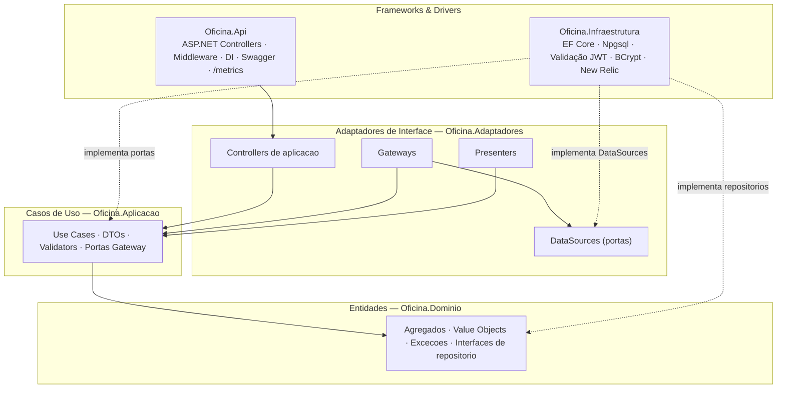
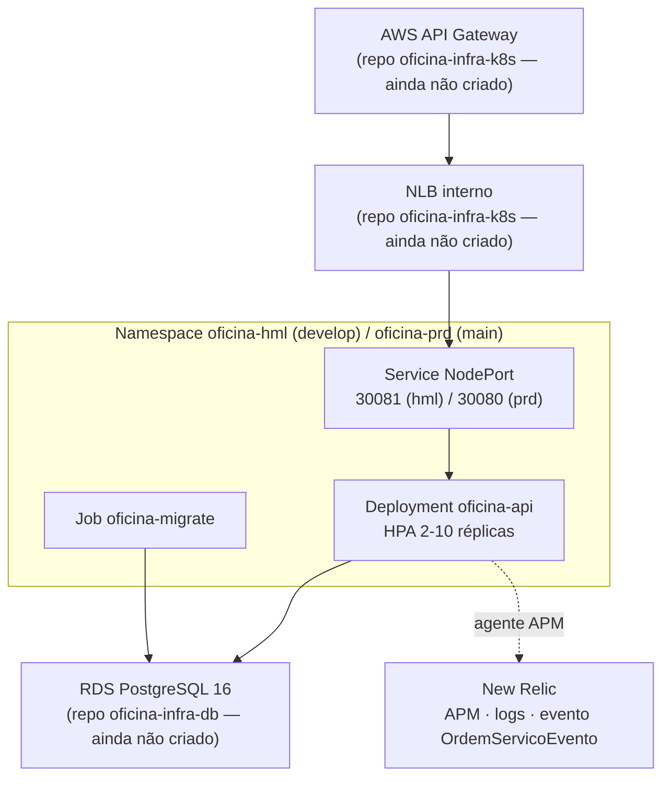
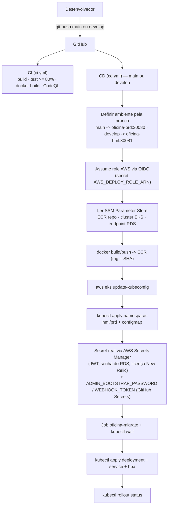

# Oficina Mecânica — API (`oficina-app`)

> **Tech Challenge — Fase 3 — Pós-Tech FIAP (15SOAT)**

Back-end de uma oficina mecânica de médio porte. O sistema gerencia clientes, veículos,
catálogo de serviços, controle de estoque e o ciclo completo da Ordem de Serviço (OS) —
da entrada do veículo à entrega.

Este repositório contém **apenas a API** (.NET 8). Na Fase 3 o projeto deixou de ser um
monorepo: autenticação, infraestrutura Kubernetes e banco de dados foram desacoplados
para repositórios próprios — veja [Repositórios relacionados](#repositórios-relacionados).
A API evoluiu para **não emitir mais tokens** (isso passou para uma função serverless),
para rodar em **dois ambientes no mesmo cluster EKS** (homologação e produção) e para ter
**observabilidade via APM** (New Relic), além do que já existia: **Clean Architecture**,
deploy contínuo via **OIDC** e **escalabilidade horizontal automática (HPA)**.

---

## Funcionalidades

- **Gestão de Clientes** (PF/PJ) e seus **veículos**
- **Catálogo de serviços** com preço base e tempo estimado
- **Controle de estoque** de peças com saldo, entradas e saídas
- **Abertura consolidada de OS** (cliente + veículo + serviços + peças em uma requisição, atômica)
- **Ordem de Serviço** com máquina de estados (Recebida → Em Diagnóstico → Aguardando Aprovação → Em Execução → Finalizada → Entregue; Cancelada via rejeição)
- **Webhook de aprovação de orçamento** autenticado por token (`X-Webhook-Token`)
- **Consulta do orçamento pelo cliente**, autenticada por token de CPF (perfil `Cliente`; resposta 404 idêntica para OS inexistente e documento não conferente — anti-enumeração)
- **Autoatendimento do cliente** (`/api/v1/me/*`): minhas ordens de serviço, meus veículos
- **Notificação de mudança de status** (mock de e-mail em log estruturado)
- **Baixa automática de estoque** ao iniciar a execução (transacional)
- **Métricas administrativas** — tempo médio de execução
- **Validação de token JWT** (HS256) emitido por uma função serverless externa — a API não emite, só valida
- **Validação de CPF/CNPJ e placa** (formatos antigo e Mercosul)
- **Documentação Swagger** em `/swagger`, **métricas Prometheus** em `/metrics` e **observabilidade via New Relic APM** (correlação de requisições, evento de negócio a cada transição de OS)

---

## Stack tecnológica

| Camada | Tecnologia |
|---|---|
| Linguagem | C# 12 / .NET 8 |
| Web | ASP.NET Core (controllers + minimal hosting) |
| ORM | Entity Framework Core 8 + Npgsql |
| Banco | PostgreSQL 16 (local via Docker; RDS em homologação/produção, provisionado por repositório próprio) |
| Auth | JWT HS256 (apenas validação) + BCrypt (usuários administrativos) |
| Validação | FluentValidation |
| Observabilidade | Serilog (Console JSON) + OpenTelemetry (`/metrics` Prometheus) + agente APM New Relic |
| Testes | xUnit + FluentAssertions + Moq + Coverlet + Testcontainers |
| Container | Docker multi-stage + docker-compose |
| Orquestração | Kubernetes (AWS EKS), HPA, dois namespaces (`oficina-hml` / `oficina-prd`) |
| CI/CD | GitHub Actions (OIDC, sem chaves estáticas) + CodeQL + Dependabot |

### Por que PostgreSQL?

Domínio fortemente relacional (cliente↔veículos↔OS↔itens↔peças), transações ACID essenciais
para integridade de orçamento e estoque, schemas separados reforçando bounded contexts,
suporte nativo a `BIGSERIAL` para o número humano-amigável da OS, gratuito e maduro.

---

## Autenticação

Esta API **não emite** tokens. Quem autentica é uma função serverless externa
(`oficina-auth-api`, repositório [`oficina-lambda-auth`](#repositórios-relacionados)):
para clientes, valida o CPF; para atendentes/admin, valida usuário e senha contra a
mesma tabela de usuários desta API. A API **apenas valida** a assinatura HS256, o emissor
(`iss=oficina-auth`) e a audiência (`aud=oficina-api`) — configurados em `Jwt__Issuer` /
`Jwt__Audience` (ver `.env.example` e `k8s/configmap.yaml`).

| Perfil | Como se obtém (fora deste repositório) | O que abre |
|---|---|---|
| `Cliente` | token emitido a partir do CPF | `/api/v1/me/*` e `/api/v1/consulta/{numeroOs}` |
| `Atendente` / `Admin` | token emitido a partir de usuário e senha | rotas de gestão (clientes, veículos, serviços, peças, ordens de serviço) |

O usuário `admin` inicial é criado **por esta API**, no bootstrap (migração/startup), a
partir de `AdminBootstrap__Password` — mas quem transforma usuário+senha em token é a
Lambda, não um endpoint aqui. O único endpoint desta API que dispensa token é o webhook
de aprovação de orçamento (`WebhooksController`, protegido por `X-Webhook-Token` em vez
de JWT — é a única exceção a `[Authorize]` em todo o projeto).

---

## Arquitetura

### 1. Camadas (Clean Architecture — 5 projetos)

A regra de dependência aponta **sempre para dentro** (em direção ao Domínio). A Infraestrutura implementa as portas declaradas nas camadas internas.



Diagramas de DDD (contextos, agregados, máquina de estados) em [docs/entrega](docs/entrega).

### 2. Arquitetura deste repositório em produção



Este repositório só controla o que está dentro do namespace (`Service`, `Deployment`,
`Job`, `ConfigMap`, `HPA`). O `Service` é do tipo **`NodePort`**, não `LoadBalancer`: quem
cria o NLB interno é o Terraform do repositório `oficina-infra-k8s`, que aponta para essa
porta fixa; o API Gateway chega até o cluster por VPC Link. Um `Service type: LoadBalancer`
criaria um segundo balanceador público, fora do controle do API Gateway.

### 3. Fluxo de deploy (CI/CD)



O CI (`ci.yml`) roda em push/PR para `main` e `develop`. O CD (`cd.yml`) roda só em push
direto para essas branches e escolhe o ambiente pelo nome da branch — não existe mais
`infra.yml` neste repositório: provisionar VPC/EKS/RDS é responsabilidade dos repositórios
de infraestrutura, ainda não criados (o CD acima só terá onde aplicar depois que eles
existirem e publicarem os parâmetros no SSM).

### Componentes da aplicação

| Projeto | Responsabilidade |
|---|---|
| `Oficina.Dominio` | Entidades/agregados, value objects, exceções e interfaces de repositório. Sem dependências externas. |
| `Oficina.Aplicacao` | Casos de uso, DTOs, validators (FluentValidation) e **portas Gateway**. |
| `Oficina.Adaptadores` | **Controllers de aplicação**, **Gateways**, **Presenters** e **DataSources** (portas de dados). Adapta os casos de uso ao mundo externo. |
| `Oficina.Infraestrutura` | EF Core (`OficinaDbContext`, migrations), implementação dos DataSources, validação de JWT, BCrypt, inicializador de banco, notificação (mock) e publicação de eventos no New Relic. |
| `Oficina.Api` | Host ASP.NET Core: controllers finos, middleware (correlação de requisições via `X-Correlation-Id`), DI, Swagger, `/metrics`, modo Job de migração. |

### Bounded Contexts

| Contexto | Tipo | Agregado raiz |
|---|---|---|
| Gestão de Clientes | Suporte | `Cliente` (com `Veiculo`) |
| Catálogo de Serviços | Suporte | `Servico` |
| Estoque | Suporte | `Peca` (com `MovimentacaoEstoque`) |
| Ordem de Serviço | **Núcleo** | `OrdemDeServico` (com `ItemServico`, `ItemPeca`) |

---

> **Retomando o trabalho?** Comece por
> **[docs/ESTADO-E-PROXIMOS-PASSOS.md](docs/ESTADO-E-PROXIMOS-PASSOS.md)** — estado atual
> da Fase 3, decisões já tomadas e o que falta fazer nos outros três repositórios.

## Repositórios relacionados

A Fase 3 divide o projeto em quatro repositórios. **Os três abaixo, além deste, ainda não
existem** — são o próximo passo da reestruturação. Enquanto não forem criados, a tabela
descreve só a responsabilidade prevista, sem link (nenhum destes nomes está publicado
ainda no GitHub).

| Repositório | Responsabilidade | Status |
|---|---|---|
| `oficina-app` (este) | API .NET 8: domínio, casos de uso, persistência, validação de JWT | Ativo |
| `oficina-infra-k8s` | VPC, EKS, ECR, NLB interno, API Gateway, VPC Link, Helm do New Relic | A criar |
| `oficina-infra-db` | RDS PostgreSQL 16, security group, parameter group | A criar |
| `oficina-lambda-auth` | Função serverless de autenticação (CPF e usuário/senha) e Lambda Authorizer | A criar |

`oficina-infra-k8s` e `oficina-infra-db` não têm dependência direta entre si.
`oficina-lambda-auth` depende do banco (consulta clientes e usuários) e define, junto com
esta API, o contrato do token (segredo HS256, `iss`/`aud`) — por isso costuma vir por
último. Este repositório (`oficina-app`) depende dos três: só faz deploy real depois que
o cluster, o banco e o segredo compartilhado existirem.

Os acoplamentos concretos que este repositório já fixou — formato do token, caminhos do
SSM, identificadores do Secrets Manager, portas, a tabela `auth.usuario` e as pendências
que atravessam a fronteira entre repositórios — estão em
**[docs/contratos-entre-repositorios.md](docs/contratos-entre-repositorios.md)**. Cada um
deles falha em silêncio se divergir, por isso está escrito e não subentendido.

---

## Como rodar localmente

### Pré-requisitos

- Docker + docker compose
- (Opcional) .NET 8 SDK para rodar fora do container

### 1. Clonar e configurar

```bash
git clone https://github.com/lcr-thiago-fernandes/oficina-app
cd oficina-app
cp .env.example .env   # ajuste ADMIN_BOOTSTRAP_PASSWORD, JWT_SECRET (>=32 chars), WEBHOOK_TOKEN
```

### 2. Subir o ambiente

```bash
docker compose -f docker/docker-compose.yml --env-file .env up -d --build
```

A primeira execução aplica todas as migrations no Postgres e cria o usuário `admin`
(senha = `ADMIN_BOOTSTRAP_PASSWORD`, perfil `Admin`, `PrecisaTrocarSenha=true`).

A imagem inclui o agente APM do New Relic, mas ele **fica inerte** sem
`NEW_RELIC_LICENSE_KEY` no `.env` (`CORECLR_ENABLE_PROFILING=0` por padrão) — a aplicação
sobe e funciona normalmente sem essa variável; ela só é necessária para ver telemetria.

### 3. Acessar

- **API**: http://localhost:8080
- **Swagger**: http://localhost:8080/swagger
- **Health**: http://localhost:8080/health
- **Métricas (Prometheus)**: http://localhost:8080/metrics

### 4. Token para testes locais

O endpoint de login **não existe mais nesta API** — quem emite token é a Lambda
`oficina-auth-api`, que não roda localmente. Para testar rotas protegidas sem ela, gere um
JWT HS256 manualmente com o mesmo segredo do `.env` (`JWT_SECRET`/`JWT_ISSUER`/`JWT_AUDIENCE`),
usando `tests/Oficina.Integracao.Testes/Auth/GeradorTokenDeTeste.cs` como referência: ele já
monta as claims certas (`sub`, `perfil`, `nome`, `jti` e, para o perfil `Cliente`,
`documento`) e assina com `iss=oficina-auth` / `aud=oficina-api`. Copie a lógica desse
arquivo para um script descartável (`dotnet-script`, um teste temporário, ou qualquer
gerador de JWT HS256 como jwt.io) e gere o token com o perfil desejado:

- `perfil=Admin` ou `perfil=Atendente` → abre as rotas de gestão.
- `perfil=Cliente` + claim `documento=<cpf>` → abre `/api/v1/me/*` e `/api/v1/consulta/{numeroOs}`.

> Não existe um utilitário de linha de comando (`tools/GerarToken`) pronto neste
> repositório — ver [decisão sobre o gerador de token](#nota-sobre-o-gerador-de-token-local)
> no fim deste documento.

---

## Deploy em Kubernetes (AWS EKS)

O deploy automático acontece pelo `cd.yml`: push em `main` implanta em `oficina-prd`
(nodePort `30080`), push em `develop` implanta em `oficina-hml` (nodePort `30081`), no
mesmo cluster. **Hoje o pipeline não tem onde aplicar**: ele lê o cluster, o repositório
ECR e o endpoint do RDS do SSM Parameter Store, parâmetros publicados pelo Terraform de
`oficina-infra-k8s`/`oficina-infra-db` — repositórios que ainda não existem. Os passos
abaixo documentam o fluxo para quando essa infraestrutura estiver no ar.

Deploy manual (mesma ordem que o CD aplica, mas com `kubectl` direto):

```bash
# 0) Pré-requisito: cluster EKS, RDS e segredos (Secrets Manager) já provisionados
#    pelos repositórios oficina-infra-k8s / oficina-infra-db / oficina-lambda-auth.
aws eks update-kubeconfig --region us-east-1 --name <nome-do-cluster>

# 1) Namespace do ambiente — namespace.yaml foi substituído por um arquivo por ambiente
kubectl apply -f k8s/namespace-prd.yaml   # ou k8s/namespace-hml.yaml
kubectl apply -f k8s/configmap.yaml       # requer ${NAMESPACE} resolvido (envsubst)

# 2) Secret real (k8s/secret.yaml é só o template/contrato das chaves — nunca aplicado)
#    Ver "kubectl create secret" no k8s/README.md e no job "Criar/atualizar Secret" do cd.yml
kubectl apply -f k8s/migration-job.yaml   # migra + bootstrap
kubectl wait --for=condition=complete job/oficina-migrate -n <namespace> --timeout=300s
kubectl apply -f k8s/deployment.yaml      # só após o Job concluir; requer ${ECR_REPOSITORY},
                                           # ${IMAGE_TAG}, ${NAMESPACE} e ${AMBIENTE} (envsubst)
kubectl apply -f k8s/service.yaml         # NodePort, não LoadBalancer
kubectl apply -f k8s/hpa.yaml             # requer metrics-server
```

Detalhes completos (probes, HPA, securityContext, NodePort vs. LoadBalancer, migração vs.
startup) em [k8s/README.md](k8s/README.md).

### Segredos e variáveis usados pelo CD (`cd.yml`)

Configurar em *Settings → Secrets and variables → Actions*. A maior parte dos valores de
infraestrutura **não vem mais daqui** — vem do AWS Secrets Manager e do SSM Parameter
Store em runtime, via OIDC.

**Secrets (sensíveis):**

| Secret | Usado para |
|---|---|
| `AWS_DEPLOY_ROLE_ARN` | Role assumida via OIDC para autenticar no AWS (ECR, EKS, Secrets Manager, SSM) |
| `ADMIN_BOOTSTRAP_PASSWORD` | Senha do usuário `admin` de bootstrap → `AdminBootstrap__Password` no Secret do K8s |
| `WEBHOOK_TOKEN` | Token do webhook de aprovação → `Webhook__Token` no Secret do K8s |

**Variables (não sensíveis):**

| Variable | Valor típico |
|---|---|
| `AWS_REGION` | `us-east-1` |

Não configurados mais como GitHub Secret/Variable (mudaram de origem):

| Antes | Agora |
|---|---|
| `DB_USER` | Não existe mais — a connection string usa um usuário fixo (`oficina_admin`) definido no pipeline |
| `DB_PASSWORD` | AWS Secrets Manager (`oficina/db_password`) |
| `JWT_SECRET` | AWS Secrets Manager (`oficina/jwt_secret`) |
| `RDS_ENDPOINT` | SSM Parameter Store (`/oficina/db/endpoint`), publicado por `oficina-infra-db` |
| `EKS_CLUSTER_NAME` | SSM Parameter Store (`/oficina/eks/cluster_name`), publicado por `oficina-infra-k8s` |
| `ECR_REPOSITORY` | SSM Parameter Store (`/oficina/ecr/repository_url`), publicado por `oficina-infra-k8s` |
| `AWS_ROLE_ARN` | Renomeado para `AWS_DEPLOY_ROLE_ARN` (acima) |

> `Jwt__Issuer` / `Jwt__Audience` continuam valores literais não sensíveis, definidos em
> `k8s/configmap.yaml` — não são injetados pelo workflow.

---

## Documentação da API

- **Swagger local**: http://localhost:8080/swagger — explorável e testável no navegador (Development).
- **Swagger publicado**: ainda não existe. Vai depender do identificador do API Gateway
  criado pelo repositório `oficina-infra-k8s` (hoje inexistente); formato esperado:
  `https://<id-do-api-gateway>.execute-api.us-east-1.amazonaws.com/swagger`.
- **Cenários `.http`** (pasta [`http/`](http/)), executáveis pela extensão REST Client (VS Code), Visual Studio ou Rider:
  - `auth.http` — **histórico da Fase 2**. O endpoint `POST /auth/login` que ele exercitava não existe mais nesta API (autenticação migrou para a função serverless) e o rate limit que ele demonstrava foi removido junto. Mantido só como registro do contrato antigo.
  - `clientes.http` — CRUD cliente + veículos
  - `servicos.http` — CRUD catálogo
  - `pecas.http` — CRUD peça + movimentações
  - `ordens-servico.http` — abertura consolidada + fluxo completo da OS
  - `webhook-aprovacao.http` — aprovação/recusa do orçamento via webhook (`X-Webhook-Token`, sem JWT)
  - `consulta.http` — consulta do orçamento pelo cliente, **com token JWT de perfil `Cliente`** na claim `documento` (deixou de ser anônima na Fase 3)
  - `fase3-demo.http` — **roteiro da demonstração da Fase 3**: token de Cliente, `/me/ordens-servico`,
    `/me/veiculos`, consulta da própria OS (200) vs. OS de outro cliente (404 anti-enumeração),
    ciclo completo da OS gerando histórico de transições, e os 422 que **não** disparam o alerta
  - `demo-video.http` — roteiro fim-a-fim da Fase 2 (**histórico**; as duas primeiras requisições
    usam o `POST /auth/login` removido, então o roteiro não roda mais nesta API)

As variáveis (`baseUrl`, `token`, `tokenCliente`, `tokenOutroCliente`, `webhookToken`, IDs)
ficam em [`.vscode/settings.json`](.vscode/settings.json) (`rest-client.environmentVariables`).
Selecione o ambiente **local** no canto inferior do VS Code.

---

## Histórico do projeto

📹 **Vídeo de demonstração da Fase 2** (≤15 min): https://1drv.ms/f/c/fa2e7c7114d0ee1e/IgAZg-pFOF5fTJ1mQ_0nRLAmAcSgougV4IOc_4BL0KM_KVw?e=9aEKXJ

Este vídeo demonstra o estado do projeto na **Fase 2** (antes da reestruturação em quatro
repositórios, da mudança de autenticação e dos dois ambientes de deploy descritos acima).
Um vídeo e um PDF de entrega equivalentes para a Fase 3 são responsabilidade de uma etapa
posterior desta reestruturação, fora do escopo deste README.

---

## Como rodar testes

```bash
# Todos os testes (unit + integração)
dotnet test

# Com cobertura
dotnet test --collect:"XPlat Code Coverage" --settings coverlet.runsettings

# Relatório HTML
dotnet tool install -g dotnet-reportgenerator-globaltool
reportgenerator -reports:"**/TestResults/**/coverage.cobertura.xml" \
                -targetdir:"TestResults/CoverageReport" \
                -reporttypes:"HtmlInline;TextSummary"
```

Os testes de integração usam **Testcontainers** (Postgres real efêmero, sem mocks) e
exigem Docker. No estado atual do repositório: **370 testes**, cobertura de linha
**89,2%** (cobertura de branch 70,2%). O CI (`ci.yml`) exige no mínimo **80%** de cobertura de linha.

---

## Estrutura de pastas

```
oficina-app/
├── .github/workflows/    # ci.yml, cd.yml + Dependabot
├── docker/                # Dockerfile + docker-compose
├── docs/
│   ├── arquitetura/       # ADRs (001-013)
│   └── entrega/           # entregáveis do Tech Challenge
├── http/                  # cenários REST Client
├── k8s/                   # manifestos Kubernetes (namespace-hml/prd, configmap, secret,
│                          #   migration-job, deployment, service, hpa) + README.md
├── src/
│   ├── Oficina.Api/
│   ├── Oficina.Aplicacao/
│   ├── Oficina.Adaptadores/
│   ├── Oficina.Dominio/
│   └── Oficina.Infraestrutura/
└── tests/
    ├── Oficina.Dominio.Testes/
    ├── Oficina.Aplicacao.Testes/
    ├── Oficina.Adaptadores.Testes/
    ├── Oficina.Infraestrutura.Testes/
    ├── Oficina.Api.Testes/
    └── Oficina.Integracao.Testes/
```

Não há mais pasta `infra/` (Terraform) neste repositório — o provisionamento de
VPC/EKS/RDS foi para os repositórios listados em
[Repositórios relacionados](#repositórios-relacionados).

---

## Segurança

- Senhas do usuário administrativo com BCrypt cost 12
- JWT HS256 validado por esta API (assinatura, emissor, audiência, expiração); quem emite é a Lambda de autenticação
- Webhook de aprovação autenticado por token (`X-Webhook-Token`), comparação em tempo constante e fail-closed — único endpoint com `[AllowAnonymous]` em todo o projeto
- Validação de CPF/CNPJ (dígitos verificadores), placa (antigo + Mercosul), e-mail
- Saldo de peça nunca negativo (invariante + check constraint SQL)
- Anti-enumeração na consulta do orçamento (404 idêntico para OS inexistente e documento não conferente)
- Segredos fora do código: `.env` local; **AWS Secrets Manager** e **SSM Parameter Store** em homologação/produção, obtidos em runtime via credenciais OIDC — não mais GitHub Secrets para os valores sensíveis de infraestrutura
- CI/CD 100% OIDC (sem chave estática); CodeQL + Dependabot ([relatório](<docs/entrega/4 - Relatório com análise de vulnerabilidades.md>))

---

## Limitações conhecidas e decisões registradas

Três pontos desta entrega parecem funcionalidades completas no código e não são. Estão
aqui para que o próximo leitor não conclua o contrário.

### 1. A propriedade da OS é resolvida por `documento`, não por `sub`

A especificação cita `sub` como identificador do sujeito. Esta API autoriza por
`documento` (CPF) em `/api/v1/me/*` e `/api/v1/consulta/{numeroOs}`, e isso é
deliberado:

- o token de Cliente é emitido **a partir do CPF** pela `oficina-auth-api` — é o dado
  que ela tem em mãos e o único que identifica o mesmo sujeito dos dois lados sem um
  lookup adicional;
- `sub` não tem significado uniforme entre perfis: num token de Cliente seria o `Id` do
  `Cliente`; num token de Admin/Atendente, o `Id` do `Usuario` — tabelas diferentes.
  Autorizar por ele exigiria saber o perfil antes de saber o que o identificador
  significa;
- `documento` já é chave única e indexada em `cliente`, então a consulta por propriedade
  não fica mais cara.

`sub` continua presente no token e é **informativo** (rastreabilidade em log e APM).
Consequência: o leitor de `sub` que existia em `ExtensoesClaims` (`IdDoSujeito`) era
código de produção morto — usado só pelos próprios testes — e foi **removido**, em vez
de mantido como API que aparenta ser suportada.

### 2. `auth.usuario` é contrato com o repositório `oficina-lambda-auth` — não é código morto

O bootstrap desta API cria o usuário `admin` e grava o hash **BCrypt** da senha em
`auth.usuario`. **Nenhum endpoint desta API verifica esse hash**: ela não emite token
desde a Fase 3. Quem lê a tabela e compara a senha é a função serverless
`oficina-auth-api`, no fluxo de login de Atendente/Admin.

Por isso `Usuario.Autenticar` e `ObterPorUsernameAsync` (gateway, data source e
interfaces das quatro camadas) permanecem **sem chamador local, de propósito**: eles
definem e sustentam o formato do dado que o outro repositório consome. Trocar o
algoritmo de hash, o nome da coluna ou o schema quebra o login lá — silenciosamente, sem
quebrar nenhum teste daqui.

### 3. `unidade` e `historico_status.usuario_id` nunca são populados — fora do escopo

`ordem_servico.unidade` existe, é indexada e vai no evento `OrdemServicoEvento`, mas
**nenhum request, header ou configuração a fornece**: `OrdemDeServico.Criar` é sempre
chamado sem o parâmetro, logo **toda OS é `"matriz"`**. A especificação justifica a
coluna pela segmentação de dashboard por unidade — segmentação que, hoje, não pode
acontecer: o painel filtrado por unidade mostraria uma fatia só.

O mesmo, em menor grau, vale para `historico_status.usuario_id`: nenhum caso de uso
propaga a identidade do chamador até o agregado, então a coluna é sempre `NULL`.

**Alimentar os dois está fora do escopo desta fase** (exigiria origem da unidade — token,
request ou configuração do pod — e propagação do usuário autenticado até o domínio).
Ficam como ponto de extensão declarado, e os comentários nas respectivas configurações
de EF Core dizem o mesmo, para que ninguém leia o campo como funcional.

---

## Nota sobre o gerador de token local

Este README aponta para `tests/Oficina.Integracao.Testes/Auth/GeradorTokenDeTeste.cs`
como referência para gerar tokens de teste, em vez de incluir um utilitário
`tools/GerarToken` pronto para rodar. Motivo: criar esse utilitário significa adicionar um
novo projeto C# à solução (um `.csproj` a mais, registrado no `Oficina.sln`), o que está
fora do escopo desta tarefa (reescrita do README, sem alterar código C#) e sem cobertura
de testes própria. A classe de teste já existe, já é exercitada pela suíte de integração
e contém exatamente as claims e a assinatura corretas — é suficiente como referência para
copiar/adaptar num script descartável, sem acrescentar superfície de manutenção ao
repositório.

---

## Licença

Projeto acadêmico — uso restrito ao Tech Challenge da FIAP.
