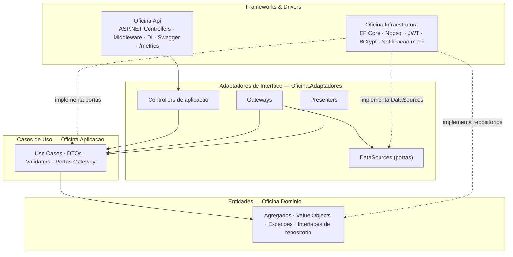
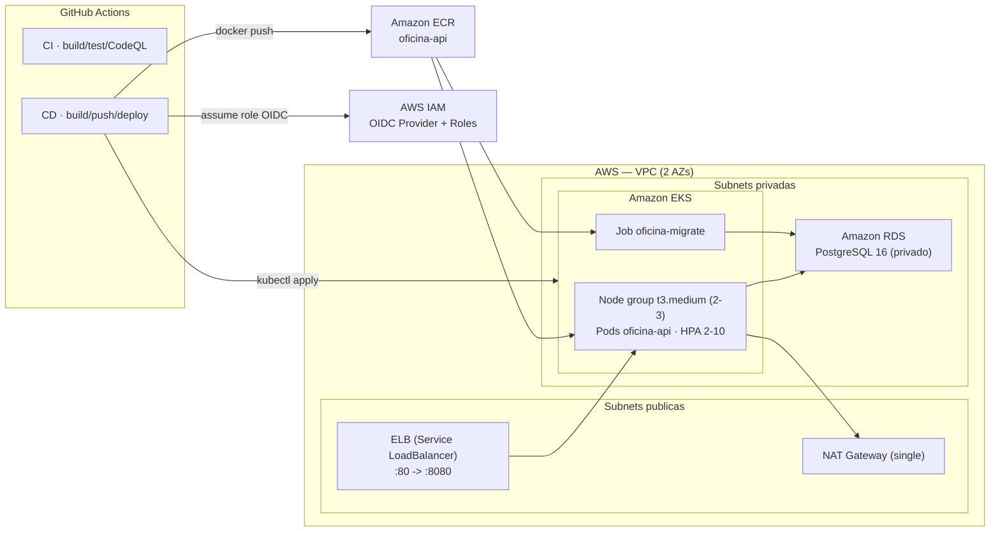
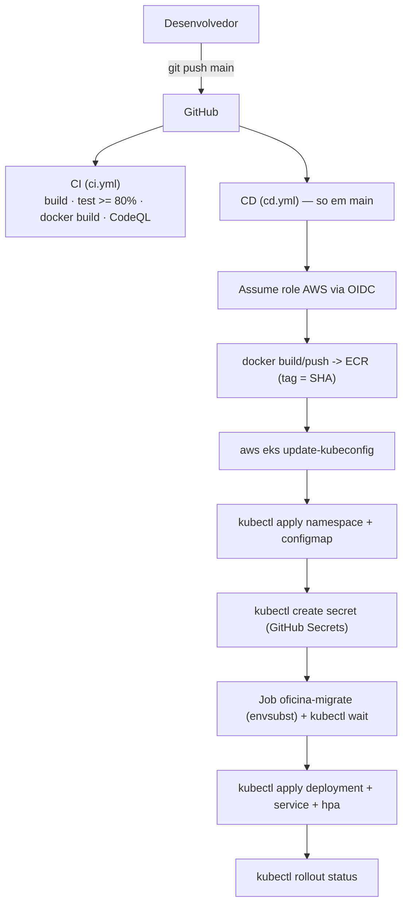

# Oficina Mecânica — Sistema Integrado de Atendimento e Execução de Serviços

> **Tech Challenge — Fase 2 — Pós-Tech FIAP (15SOAT)**

Back-end de uma oficina mecânica de médio porte. O sistema unifica gestão de clientes, veículos, catálogo de serviços, controle de estoque e o ciclo completo da Ordem de Serviço (OS) — da entrada do veículo à entrega.

A **Fase 2** evolui o MVP da Fase 1 com foco em **qualidade, resiliência e escalabilidade**: refatoração para **Clean Architecture** (Controllers/Gateways/Presenters/DataSources de aplicação), empacotamento e orquestração em **Kubernetes (AWS EKS)** com **RDS PostgreSQL** provisionados por **Terraform**, pipeline **CI/CD** com deploy contínuo via **OIDC**, **escalabilidade horizontal automática (HPA)** e **observabilidade mínima** (`/metrics`).

---

## Funcionalidades

- ✅ **Gestão de Clientes** (PF/PJ) e seus **veículos**
- ✅ **Catálogo de serviços** com preço base e tempo estimado
- ✅ **Controle de estoque** de peças com saldo, entradas e saídas
- ✅ **Abertura consolidada de OS** (cliente + veículo + serviços + peças em uma requisição, atômica)
- ✅ **Ordem de Serviço** com máquina de estados (Recebida → Em Diagnóstico → Aguardando Aprovação → Em Execução → Finalizada → Entregue; Cancelada via rejeição)
- ✅ **Webhook de aprovação de orçamento** autenticado por token (`X-Webhook-Token`)
- ✅ **Consulta pública** do orçamento pelo cliente (sem JWT, anti-enumeração)
- ✅ **Notificação de mudança de status** (mock de e-mail em log estruturado)
- ✅ **Baixa automática de estoque** ao iniciar a execução (transacional)
- ✅ **Métricas administrativas** — tempo médio de execução
- ✅ **Autenticação JWT** para usuários administrativos (perfis Admin/Atendente)
- ✅ **Validação de CPF/CNPJ e placa** (formatos antigo e Mercosul)
- ✅ **Documentação Swagger** em `/swagger` e **métricas Prometheus** em `/metrics`

---

## Stack tecnológica

| Camada | Tecnologia |
|---|---|
| Linguagem | C# 12 / .NET 8 |
| Web | ASP.NET Core (controllers + minimal hosting) |
| ORM | Entity Framework Core 8 + Npgsql |
| Banco | PostgreSQL 16 (local via Docker; AWS RDS em produção) |
| Auth | JWT HS256 + BCrypt + RateLimiting nativo |
| Validação | FluentValidation |
| Observabilidade | Serilog (Console JSON) + OpenTelemetry (`/metrics` Prometheus) |
| Testes | xUnit + FluentAssertions + Moq + Coverlet + Testcontainers |
| Container | Docker multi-stage + docker-compose |
| Orquestração | Kubernetes (AWS EKS), HPA |
| Infra como código | Terraform (VPC, EKS, RDS, ECR, OIDC) |
| CI/CD | GitHub Actions (OIDC) + CodeQL + Dependabot |

### Por que PostgreSQL?

Domínio fortemente relacional (cliente↔veículos↔OS↔itens↔peças), transações ACID essenciais para integridade de orçamento e estoque, schemas separados reforçando bounded contexts, suporte nativo a `BIGSERIAL` para o número humano-amigável da OS, gratuito e maduro. Em produção roda como **AWS RDS PostgreSQL 16**.

---

## Arquitetura

### 1. Camadas (Clean Architecture — 5 projetos)

A regra de dependência aponta **sempre para dentro** (em direção ao Domínio). A Infraestrutura implementa as portas declaradas nas camadas internas.



Diagramas de DDD (contextos, agregados, máquina de estados) em [docs/entrega](docs/entrega).

### 2. Infraestrutura AWS



Estado do Terraform em **S3 + DynamoDB**. Detalhes e custo em [infra/README.md](infra/README.md) e [k8s/README.md](k8s/README.md).

### 3. Fluxo de deploy (CI/CD)



### Componentes da aplicação

| Projeto | Responsabilidade |
|---|---|
| `Oficina.Dominio` | Entidades/agregados, value objects, exceções e interfaces de repositório. Sem dependências externas. |
| `Oficina.Aplicacao` | Casos de uso, DTOs, validators (FluentValidation) e **portas Gateway**. |
| `Oficina.Adaptadores` | **Controllers de aplicação**, **Gateways**, **Presenters** e **DataSources** (portas de dados). Adapta os casos de uso ao mundo externo. |
| `Oficina.Infraestrutura` | EF Core (`OficinaDbContext`, migrations), implementação dos DataSources, JWT, BCrypt, inicializador de banco e notificação (mock). |
| `Oficina.Api` | Host ASP.NET Core: controllers finos, middleware, DI, Swagger, `/metrics`, modo Job de migração. |

### Bounded Contexts

| Contexto | Tipo | Agregado raiz |
|---|---|---|
| Gestão de Clientes | Suporte | `Cliente` (com `Veiculo`) |
| Catálogo de Serviços | Suporte | `Servico` |
| Estoque | Suporte | `Peca` (com `MovimentacaoEstoque`) |
| Ordem de Serviço | **Núcleo** | `OrdemDeServico` (com `ItemServico`, `ItemPeca`) |

### Infraestrutura provisionada (Terraform)

VPC (2 AZs, subnets públicas/privadas, NAT único), **EKS** (1 node group `t3.medium`, addons, access entry para o CI), **RDS PostgreSQL 16** (`db.t3.micro`, privado), **ECR** (`oficina-api`, scan on push), **OIDC** do GitHub Actions (roles de deploy e de infra), **metrics-server** (Helm, para o HPA). Estado remoto em **S3 + DynamoDB**.

---

## Como rodar localmente

### Pré-requisitos

- Docker + docker compose
- (Opcional) .NET 8 SDK para rodar fora do container

### 1. Clonar e configurar

```bash
git clone https://github.com/lcr-thiago-fernandes/fiap_15SOAT_fase2
cd fiap_15SOAT_fase2
cp .env.example .env   # ajuste ADMIN_BOOTSTRAP_PASSWORD, JWT_SECRET (>=64 chars), WEBHOOK_TOKEN
```

### 2. Subir o ambiente

```bash
docker compose -f docker/docker-compose.yml --env-file .env up -d --build
```

A primeira execução aplica todas as migrations no Postgres e cria o usuário `admin` (senha = `ADMIN_BOOTSTRAP_PASSWORD`, exige troca no primeiro login).

### 3. Acessar

- **API**: http://localhost:8080
- **Swagger**: http://localhost:8080/swagger
- **Health**: http://localhost:8080/health
- **Métricas (Prometheus)**: http://localhost:8080/metrics

### 4. Login

```bash
curl -X POST http://localhost:8080/api/v1/auth/login \
  -H "Content-Type: application/json" \
  -d '{"username":"admin","password":"<sua-senha>"}'
```

Use o `accessToken` no header `Authorization: Bearer ...` nas chamadas administrativas.

---

## Deploy em Kubernetes (AWS EKS)

Há dois caminhos: **CD automático** (push em `main` dispara `cd.yml`) ou **manual**. O manual:

```bash
# 1) Provisionar a infra (Terraform) — ver "Provisionamento (Terraform)" abaixo
# 2) Apontar o kubeconfig para o cluster
aws eks update-kubeconfig --region us-east-1 --name $(terraform -chdir=infra output -raw cluster_name)

# 3) Aplicar os manifestos NA ORDEM (o Secret real é criado a partir de segredos, não do template)
kubectl apply -f k8s/namespace.yaml
kubectl apply -f k8s/configmap.yaml
kubectl apply -f k8s/secret.yaml          # template; no deploy real use kubectl create secret (ver k8s/README.md)
kubectl apply -f k8s/migration-job.yaml   # migra + bootstrap
kubectl wait --for=condition=complete job/oficina-migrate -n oficina --timeout=300s
kubectl apply -f k8s/deployment.yaml      # só após o Job concluir
kubectl apply -f k8s/service.yaml
kubectl apply -f k8s/hpa.yaml             # requer metrics-server
```

Detalhes completos (probes, HPA, securityContext, migração vs. startup) em [k8s/README.md](k8s/README.md).

## Provisionamento (Terraform)

```bash
# Bootstrap do backend (UMA vez): bucket S3 + tabela DynamoDB — ver infra/README.md
cd infra
export TF_VAR_db_password='<senha-forte-do-rds>'
terraform init
terraform plan
terraform apply     # ~15-20 min (EKS)
# ... demo ...
terraform destroy   # remova antes o Service LoadBalancer para não deixar ELB órfão
```

Recursos, pré-requisitos e estimativa de custo em [infra/README.md](infra/README.md).

### GitHub Secrets e Variables exigidos pelo CI/CD

Configurar em *Settings → Secrets and variables → Actions* antes de rodar `cd.yml`/`infra.yml`.

**Secrets (sensíveis — nunca ecoados):**

| Secret | Usado em | Origem / valor |
|---|---|---|
| `AWS_ROLE_ARN` | `cd.yml` | output `github_actions_role_arn` do Terraform (role OIDC de deploy) |
| `AWS_TERRAFORM_ROLE_ARN` | `infra.yml` | role admin (opcional — só se usar o `infra.yml`) |
| `DB_USER` | `cd.yml`, `infra.yml` | usuário do RDS (`ConnectionStrings__Default` / `TF_VAR_db_username`) |
| `DB_PASSWORD` | `cd.yml`, `infra.yml` | senha do RDS (`ConnectionStrings__Default` / `TF_VAR_db_password`) |
| `RDS_ENDPOINT` | `cd.yml` | output `rds_endpoint` (host da connection string) |
| `JWT_SECRET` | `cd.yml` | ≥64 chars (HS256) → `Jwt__Secret` |
| `ADMIN_BOOTSTRAP_PASSWORD` | `cd.yml` | senha do admin de bootstrap → `AdminBootstrap__Password` |
| `WEBHOOK_TOKEN` | `cd.yml` | token do webhook → `Webhook__Token` |

**Variables (não sensíveis):**

| Variable | Usado em | Valor típico |
|---|---|---|
| `AWS_REGION` | `cd.yml`, `infra.yml` | `us-east-1` |
| `EKS_CLUSTER_NAME` | `cd.yml` | output `cluster_name` (`oficina-eks`) |
| `ECR_REPOSITORY` | `cd.yml` | output `ecr_repository_url` (URL completa) |

> `Jwt__Issuer`/`Jwt__Audience` são valores literais não sensíveis no `k8s/configmap.yaml` (não injetados pelos workflows).

---

## Coleção de APIs (Swagger + `http/`)

A coleção de requisições é dupla:

- **Swagger UI** (OpenAPI): http://localhost:8080/swagger — explorável e testável no navegador (Development).
- **Cenários `.http`** (pasta [`http/`](http/)), executáveis pela extensão REST Client (VS Code), Visual Studio ou Rider:
  - `auth.http` — login, rate limit
  - `clientes.http` — CRUD cliente + veículos
  - `servicos.http` — CRUD catálogo
  - `pecas.http` — CRUD peça + movimentações
  - `ordens-servico.http` — abertura consolidada + fluxo completo da OS
  - `webhook-aprovacao.http` — aprovação/recusa do orçamento via webhook (`X-Webhook-Token`)
  - `consulta.http` — consulta pública do orçamento (cliente, sem JWT)
  - `demo-video.http` — roteiro fim-a-fim para a demonstração

As variáveis (`baseUrl`, `token`, `webhookToken`, IDs) ficam em [`.vscode/settings.json`](.vscode/settings.json) (`rest-client.environmentVariables`). Selecione o ambiente **local** no canto inferior do VS Code.

## Vídeo de demonstração

📹 **Link do vídeo (YouTube/Vimeo, ≤15 min):** `<INSERIR-LINK-DO-VIDEO>`

Roteiro em [docs/entrega/roteiro-video-fase2.md](docs/entrega/roteiro-video-fase2.md).

---

## Como rodar testes

```bash
# Todos os testes (unit + integração)
dotnet test

# Com cobertura
dotnet test --collect:"XPlat Code Coverage" --settings coverlet.runsettings

# Relatório HTML
dotnet tool install -g dotnet-reportgenerator-globaltool
reportgenerator -reports:"**/TestResults/**/coverage.cobertura.xml" \
                -targetdir:"TestResults/CoverageReport" \
                -reporttypes:"HtmlInline;TextSummary"
```

Os testes de integração usam **Testcontainers** (Postgres real efêmero, sem mocks) e exigem Docker. **Cobertura mínima exigida pelo CI:** 80% (`.github/workflows/ci.yml`).

---

## Estrutura de pastas

```
fiap_15SOAT_fase2/
├── .github/workflows/    # ci.yml, cd.yml, infra.yml + Dependabot
├── docker/               # Dockerfile + docker-compose
├── docs/
│   ├── arquitetura/      # ADRs (001-013)
│   └── entrega/          # entregáveis do Tech Challenge
├── http/                 # cenários REST Client
├── infra/                # Terraform (VPC, EKS, RDS, ECR, OIDC)
├── k8s/                  # manifestos Kubernetes
├── src/
│   ├── Oficina.Api/
│   ├── Oficina.Aplicacao/
│   ├── Oficina.Adaptadores/
│   ├── Oficina.Dominio/
│   └── Oficina.Infraestrutura/
└── tests/
    ├── Oficina.Dominio.Testes/
    ├── Oficina.Aplicacao.Testes/
    ├── Oficina.Adaptadores.Testes/
    ├── Oficina.Infraestrutura.Testes/
    └── Oficina.Integracao.Testes/
```

---

## Segurança

- Senhas com BCrypt cost 12; JWT HS256, expiração 60 min, sem refresh token (MVP)
- Rate limit 5 tentativas / 15 min por IP no login
- Webhook de aprovação autenticado por token (`X-Webhook-Token`), comparação em tempo constante e fail-closed
- Validação de CPF/CNPJ (dígitos verificadores), placa (antigo + Mercosul), e-mail
- Saldo de peça nunca negativo (invariante + check constraint SQL)
- Anti-enumeração na consulta pública (404 idêntico para OS inexistente e documento não conferente)
- Segredos fora do código: `.env` local, GitHub Secrets + Kubernetes Secret em produção
- CI/CD 100% OIDC (sem chave estática); CodeQL + Dependabot ([relatório](docs/entrega/4 - Relatório com análise de vulnerabilidades.md))

---

## Licença

Projeto acadêmico — uso restrito ao Tech Challenge da FIAP.
