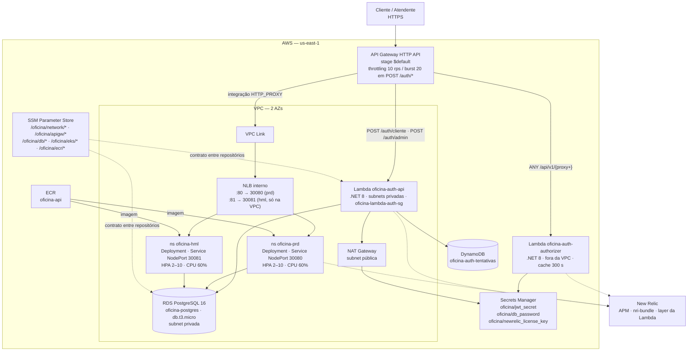

# Diagrama de componentes — Fase 3

Visão de nuvem dos quatro repositórios em execução. A cor não tem significado; as caixas
`subgraph` são limites de rede. Quem cria cada recurso está em
[RFC-004](../../rfc/RFC-004-topologia-quatro-repositorios.md).

## Quem cria o quê

| Componente | Repositório |
|---|---|
| VPC, NAT, EKS, node group, ECR, NLB, VPC Link, API Gateway, roles OIDC, New Relic (Helm, dashboards, alertas) | `oficina-infra-k8s` |
| RDS, DB subnet group, security group do RDS, parameter group, `oficina/db_password` | `oficina-infra-db` |
| `oficina-auth-api`, `oficina-auth-authorizer`, rotas `/auth/*` e `ANY /api/v1/{proxy+}`, DynamoDB de tentativas | `oficina-lambda-auth` |
| Imagem da API, manifests dos dois namespaces, migrations | `oficina-app` |

O `NLB` desenha as duas setas para `PRD` e `HML`, mas só `:80` é alcançável pelo API Gateway;
homologação exige estar dentro da VPC ([ADR-018](../ADR-018-ambientes-por-namespace.md)).
