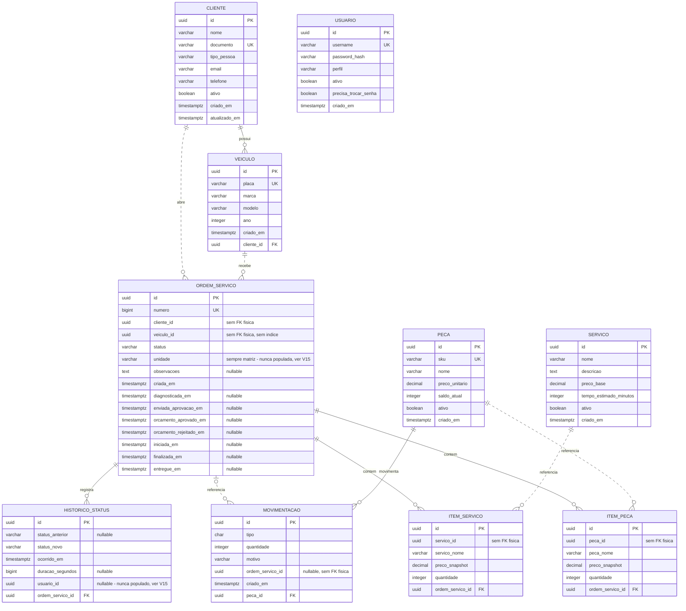

# Modelo entidade-relacionamento

Schema completo do banco `oficina`, incluindo os ajustes da Fase 3. Justificativa em
[RFC-002](../../rfc/RFC-002-banco-rds-postgresql.md); a tabela de histórico em
[ADR-020](../ADR-020-historico-status.md).

Extraído de `src/Oficina.Infraestrutura/Migrations/OficinaDbContextModelSnapshot.cs`, das dez
configurações em `src/Oficina.Infraestrutura/Persistencia/Configuracoes/` e conferido contra as
migrations reais (a última é `20260914125322_HistoricoStatusEUnidade`). São **10 tabelas físicas**
em 5 schemas — `HasDefaultSchema("public")` do `OficinaDbContext` nunca se aplica na prática, porque
toda entidade sobrepõe o schema explicitamente em `ToTable(nome, schema)`.

Nas linhas do diagrama, **traço contínuo** = existe `FOREIGN KEY` física no banco (`table.ForeignKey`
numa migration real). **Traço tracejado** = referência lógica (a coluna guarda o `id` da outra
tabela, e o código a usa para consultar), mas **sem** constraint de FK — não é uma das divergências
V1..V15, é um achado desta tarefa ao conferir migration por migration.

`USUARIO` (schema `auth`) aparece solta no diagrama porque **não tem relacionamento** com as demais
tabelas — nem FK, nem referência lógica. O bootstrap desta API cria o usuário `admin` e grava o hash
BCrypt da senha em `auth.usuario`, mas **nenhum endpoint desta API verifica esse hash**: quem lê a
tabela e compara a senha é a função serverless `oficina-auth-api`, no repositório
`oficina-lambda-auth`, no fluxo de login de Atendente/Admin. `Usuario.Autenticar` e
`ObterPorUsernameAsync` ficam sem chamador local, de propósito: sustentam o formato do dado que o
outro repositório consome (README deste repositório, seção "Limitações conhecidas e decisões
registradas", item 2).

## Schemas

| Schema | Tabelas |
|---|---|
| `auth` | `usuario` |
| `catalogo` | `servico` |
| `clientes` | `cliente`, `veiculo` |
| `estoque` | `peca`, `movimentacao` |
| `os` | `ordem_servico`, `item_peca`, `item_servico`, `historico_status` |

Nenhuma tabela vive em `public`: é o schema default do `DbContext`, mas todas as dez entidades
sobrepõem o schema em `ToTable`.

## Colunas e tipos físicos completos

Tipo físico exatamente como aparece na migration (`character varying(N)` em vez do `varchar`
genérico do diagrama, que o parser do Mermaid não aceita com parênteses).

### `auth.usuario`

| Coluna | Tipo físico | Nulável |
|---|---|---|
| `id` | `uuid` | não |
| `username` | `character varying(50)` | não |
| `password_hash` | `character varying(255)` | não |
| `perfil` | `character varying(20)` | não |
| `ativo` | `boolean` | não |
| `precisa_trocar_senha` | `boolean` | não |
| `criado_em` | `timestamp with time zone` | não |

PK: `id`. Índice único: `IX_usuario_username` (`username`).

### `catalogo.servico`

| Coluna | Tipo físico | Nulável |
|---|---|---|
| `id` | `uuid` | não |
| `nome` | `character varying(120)` | não |
| `descricao` | `text` | não |
| `preco_base` | `numeric(10,2)` | não |
| `tempo_estimado_minutos` | `integer` | não |
| `ativo` | `boolean` | não |
| `criado_em` | `timestamp with time zone` | não |

PK: `id`. Índice: `IX_servico_nome` (`nome`, não único).

### `clientes.cliente`

| Coluna | Tipo físico | Nulável |
|---|---|---|
| `id` | `uuid` | não |
| `nome` | `character varying(150)` | não |
| `documento` | `character varying(14)` | não |
| `tipo_pessoa` | `character varying(2)` | não |
| `email` | `character varying(150)` | não |
| `telefone` | `character varying(20)` | não |
| `ativo` | `boolean` | não |
| `criado_em` | `timestamp with time zone` | não |
| `atualizado_em` | `timestamp with time zone` | não |

PK: `id`. Índice único: `IX_cliente_documento` (`documento`). `documento`, `tipo_pessoa`, `email` e
`telefone` são colunas do value object correspondente mapeadas por `OwnsOne` na mesma tabela (sem
tabela separada).

### `clientes.veiculo`

| Coluna | Tipo físico | Nulável |
|---|---|---|
| `id` | `uuid` | não |
| `placa` | `character varying(7)` | não |
| `marca` | `character varying(50)` | não |
| `modelo` | `character varying(80)` | não |
| `ano` | `integer` | não |
| `criado_em` | `timestamp with time zone` | não |
| `cliente_id` | `uuid` | não |

PK: `id`. FK: `FK_veiculo_cliente_cliente_id` (`cliente_id` → `clientes.cliente.id`, `ON DELETE
CASCADE`). Índices: `IX_veiculo_cliente_id` (`cliente_id`), `IX_veiculo_placa` (`placa`, único).

### `estoque.peca`

| Coluna | Tipo físico | Nulável |
|---|---|---|
| `id` | `uuid` | não |
| `sku` | `character varying(50)` | não |
| `nome` | `character varying(120)` | não |
| `preco_unitario` | `numeric(10,2)` | não |
| `saldo_atual` | `integer` | não |
| `ativo` | `boolean` | não |
| `criado_em` | `timestamp with time zone` | não |

PK: `id`. Índice único: `IX_peca_sku` (`sku`).

### `estoque.movimentacao`

| Coluna | Tipo físico | Nulável |
|---|---|---|
| `id` | `uuid` | não |
| `tipo` | `char(1)` | não |
| `quantidade` | `integer` | não |
| `motivo` | `character varying(100)` | não |
| `ordem_servico_id` | `uuid` | **sim** |
| `criado_em` | `timestamp with time zone` | não |
| `peca_id` | `uuid` | não |

PK: `id`. FK: `FK_movimentacao_peca_peca_id` (`peca_id` → `estoque.peca.id`, `ON DELETE CASCADE`).
`ordem_servico_id` **não tem FK declarada** — é coluna solta, nula quando a movimentação não decorre
de uma OS. Índice: `ix_movimentacao_peca_data` (`peca_id`, `criado_em`). Check constraint:
`ck_movimentacao_quantidade_positiva` (`quantidade > 0`).

### `os.ordem_servico`

| Coluna | Tipo físico | Nulável |
|---|---|---|
| `id` | `uuid` | não |
| `numero` | `bigint` (`bigserial`) | não |
| `cliente_id` | `uuid` | não |
| `veiculo_id` | `uuid` | não |
| `status` | `character varying(30)` | não |
| `unidade` | `character varying(60)` (default `'matriz'`) | não |
| `observacoes` | `text` | **sim** |
| `criada_em` | `timestamp with time zone` | não |
| `diagnosticada_em` | `timestamp with time zone` | **sim** |
| `enviada_aprovacao_em` | `timestamp with time zone` | **sim** |
| `orcamento_aprovado_em` | `timestamp with time zone` | **sim** |
| `orcamento_rejeitado_em` | `timestamp with time zone` | **sim** |
| `iniciada_em` | `timestamp with time zone` | **sim** |
| `finalizada_em` | `timestamp with time zone` | **sim** |
| `entregue_em` | `timestamp with time zone` | **sim** |

PK: `id`. **Nenhuma FK declarada** para `cliente_id` nem `veiculo_id` (`ForeignKey` não aparece em
nenhuma migration para esta tabela) — só colunas `uuid` obrigatórias, uma indexada e a outra não.
Índices: `IX_ordem_servico_numero` (`numero`, único), `IX_ordem_servico_cliente_id` (`cliente_id`),
`ix_ordem_servico_status_data` (`status`, `criada_em`), `ix_ordem_servico_unidade` (`unidade`). O
índice original `IX_ordem_servico_status` (só `status`) foi **derrubado** na migration
`20260914125322_HistoricoStatusEUnidade` e substituído pelo composto acima.

### `os.item_peca`

| Coluna | Tipo físico | Nulável |
|---|---|---|
| `id` | `uuid` | não |
| `peca_id` | `uuid` | não |
| `peca_nome` | `character varying(120)` | não |
| `preco_snapshot` | `numeric(10,2)` | não |
| `quantidade` | `integer` | não |
| `ordem_servico_id` | `uuid` | não |

PK: `id`. FK: `FK_item_peca_ordem_servico_ordem_servico_id` (`ordem_servico_id` →
`os.ordem_servico.id`, `ON DELETE CASCADE`). `peca_id` **não tem FK declarada** — `peca_nome` e
`preco_snapshot` são o snapshot do catálogo no momento da inclusão (ADR-005), e `peca_id` sobra como
referência lógica sem constraint. Índice: `IX_item_peca_ordem_servico_id` (`ordem_servico_id`). Check
constraints (adicionadas em `20260914125322_HistoricoStatusEUnidade`):
`ck_item_peca_quantidade_positiva` (`quantidade > 0`), `ck_item_peca_preco_nao_negativo`
(`preco_snapshot >= 0`).

### `os.item_servico`

| Coluna | Tipo físico | Nulável |
|---|---|---|
| `id` | `uuid` | não |
| `servico_id` | `uuid` | não |
| `servico_nome` | `character varying(120)` | não |
| `preco_snapshot` | `numeric(10,2)` | não |
| `quantidade` | `integer` | não |
| `ordem_servico_id` | `uuid` | não |

PK: `id`. FK: `FK_item_servico_ordem_servico_ordem_servico_id` (`ordem_servico_id` →
`os.ordem_servico.id`, `ON DELETE CASCADE`). `servico_id` **não tem FK declarada**, pelo mesmo motivo
de `item_peca` (ADR-005). Índice: `IX_item_servico_ordem_servico_id` (`ordem_servico_id`). Check
constraints (mesma migration de `item_peca`): `ck_item_servico_quantidade_positiva`
(`quantidade > 0`), `ck_item_servico_preco_nao_negativo` (`preco_snapshot >= 0`).

### `os.historico_status`

| Coluna | Tipo físico | Nulável |
|---|---|---|
| `id` | `uuid` | não |
| `status_anterior` | `character varying(30)` | **sim** |
| `status_novo` | `character varying(30)` | não |
| `ocorrido_em` | `timestamp with time zone` | não |
| `duracao_segundos` | `bigint` | **sim** |
| `usuario_id` | `uuid` | **sim** |
| `ordem_servico_id` | `uuid` | não |

PK: `id`. FK: `FK_historico_status_ordem_servico_ordem_servico_id` (`ordem_servico_id` →
`os.ordem_servico.id`, `ON DELETE CASCADE`). Tabela criada por
`20260914125322_HistoricoStatusEUnidade` (ADR-020). Índices: `ix_historico_os`
(`ordem_servico_id`, `ocorrido_em`), `ix_historico_status_data` (`status_anterior`, `ocorrido_em`).

## Índices e restrições relevantes

| Objeto | O quê | Por quê |
|---|---|---|
| `IX_usuario_username` | Índice único em `auth.usuario.username` | login por username é o caminho do `oficina-lambda-auth`; precisa ser único |
| `IX_cliente_documento` | Índice único em `clientes.cliente.documento` | CPF/CNPJ é o identificador de autenticação de Cliente (V6) e regra de negócio: documento não pode repetir |
| `IX_veiculo_placa` | Índice único em `clientes.veiculo.placa` | placa é identificador único de veículo |
| `IX_peca_sku` | Índice único em `estoque.peca.sku` | SKU é o identificador único de peça no catálogo |
| `IX_ordem_servico_numero` | Índice único em `os.ordem_servico.numero` | `numero` é o identificador público da OS (`GET /api/v1/consulta/{numeroOs}`); não pode repetir |
| `ix_ordem_servico_status_data` | Índice composto `(status, criada_em)` | padrão de acesso real: filtrar OS por status e ordenar pela data de abertura (comentário em `OrdemDeServicoConfiguration`) |
| `ix_ordem_servico_unidade` | Índice em `unidade` | suporte à dimensão de segmentação por unidade nos dashboards — hoje inútil na prática, pois `unidade` é sempre `"matriz"` (V15) |
| `ix_movimentacao_peca_data` | Índice composto `(peca_id, criado_em)` | consulta "histórico de movimentação de uma peça", ordenado no tempo |
| `ix_historico_os` | Índice composto `(ordem_servico_id, ocorrido_em)` | consulta "linha do tempo de uma OS" (comentário em `HistoricoStatusConfiguration`) |
| `ix_historico_status_data` | Índice composto `(status_anterior, ocorrido_em)` | consulta do dashboard: tempo médio por status de origem numa janela (comentário em `HistoricoStatusConfiguration`) |
| `ck_movimentacao_quantidade_positiva` | Check `quantidade > 0` em `estoque.movimentacao` | não existe movimentação de estoque com quantidade zero ou negativa |
| `ck_item_peca_quantidade_positiva` / `ck_item_servico_quantidade_positiva` | Check `quantidade > 0` | mesma regra para itens de OS: não existe item com quantidade zero ou negativa |
| `ck_item_peca_preco_nao_negativo` / `ck_item_servico_preco_nao_negativo` | Check `preco_snapshot >= 0` | preço snapshot não pode ser negativo |

## Colunas que existem e nunca são preenchidas

| Coluna | Estado |
|---|---|
| `os.ordem_servico.unidade` | toda OS nasce `"matriz"`; nenhum request, header ou configuração fornece o valor |
| `os.historico_status.usuario_id` | sempre `NULL`; nenhum caso de uso propaga a identidade do chamador até o agregado |

Confirmado no código: `OrdemDeServico.Criar(Guid clienteId, Guid veiculoId, string? observacoes =
null, string unidade = "matriz")` tem `unidade` com valor padrão e nenhum chamador o passa;
`RegistrarTransicao` chama `HistoricoStatus.Criar(anterior, novo, agora, duracao)` sem o parâmetro
opcional `usuarioId`, que fica sempre `null`. Alimentar as duas está fora do escopo da Fase 3. Estão
aqui para que o leitor não conclua que a segmentação por unidade funciona.
