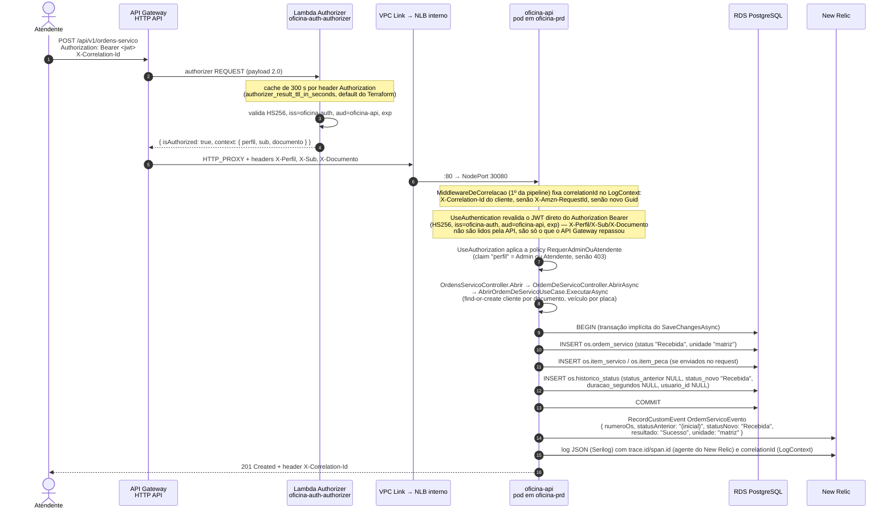

# Sequência — abertura de ordem de serviço

Caminho completo de `POST /api/v1/ordens-servico`, do token ao evento de negócio que alimenta o
dashboard. Tabela do histórico de status em [ADR-020](../ADR-020-historico-status.md);
observabilidade em [RFC-005](../../rfc/RFC-005-observabilidade-new-relic.md).

## Pontos que não são óbvios no desenho

| Ponto | Por quê |
|---|---|
| A API revalida o JWT | alcançar o NLB por dentro da VPC não pode bastar para usar rota protegida; os headers `X-Perfil`/`X-Sub`/`X-Documento` que o API Gateway repassa são informativos — a API nem os lê, ela decide tudo a partir das claims do próprio token (`ConfiguracaoJwt`, `PoliticasDeAutorizacao`) |
| `MiddlewareDeCorrelacao` roda antes da autenticação | é o primeiro middleware do pipeline (`Program.cs`); o `correlationId` entra no `LogContext` mesmo que a requisição venha a ser barrada por `UseAuthentication`/`UseAuthorization` logo depois |
| O caso de uso real é `AbrirOrdemDeServicoUseCase`, não `CriarOrdemUseCase` | `CriarOrdemUseCase` existe e está registrado no DI, mas nenhum endpoint de `OrdensServicoController` o chama; o `POST` de fato passa por `OrdemDeServicoController.AbrirAsync` → `AbrirOrdemDeServicoUseCase`, que também resolve cliente (por documento) e veículo (por placa) find-or-create antes de criar a OS |
| `historico_status` na mesma transação da OS | histórico é efeito colateral do domínio (`OrdemDeServico.RegistrarTransicao`), sem `Add()` explícito; o `ChangeTracker.Tracked` do `OficinaDbContext` marca a entrada como `Added` e um único `SaveChangesAsync` grava OS + itens + histórico numa transação implícita — se a escrita do histórico ficasse fora, o dashboard de tempo médio por status divergiria do estado real |
| `duracao_segundos` NULL nesta entrada específica é esperado | é a primeira entrada do histórico da OS (não há transição anterior para medir); o defeito real de uma revisão anterior — a leitura não incluía `Historico` e a duração saía sempre nula **mesmo em transições seguintes** — já está corrigido em `OrdemDeServicoDataSource.ObterPorIdAsync`/`ObterPorNumeroAsync`, que agora fazem `Include(o => o.Historico.OrderBy(h => h.OcorridoEm))` |
| `OrdemServicoEvento` com `statusNovo = "Recebida"` na criação | antes de uma correção anterior a criação da OS não estava instrumentada; hoje `AbrirOrdemDeServicoUseCase` publica o evento via `ExecutarTransicaoComTelemetriaAsync`, senão o painel de volume diário nasce vazio |
| `unidade` sempre `"matriz"` e `historico_status.usuario_id` sempre `NULL` | nenhum request, header ou configuração alimenta essas colunas (V15) — ver [ADR-020](../ADR-020-historico-status.md) |
| Rota de gestão exige perfil `Admin` ou `Atendente` | `[Authorize(Policy = PoliticasDeAutorizacao.RequerAdminOuAtendente)]` no nível do controller; um token de `Cliente` recebe 403 |
