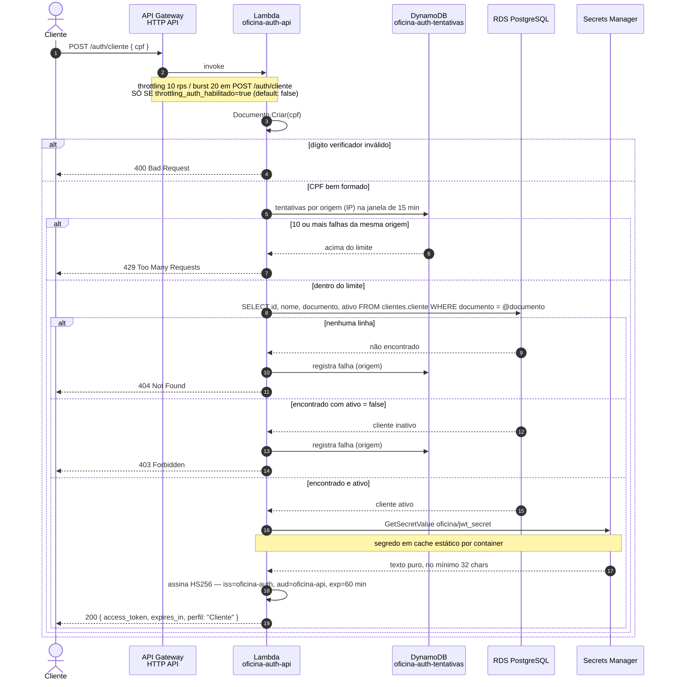

# Sequência — autenticação por CPF

`POST /auth/cliente`, com os quatro caminhos de erro e o de sucesso. Decisões em
[ADR-015](../ADR-015-lambda-authorizer-hs256.md) e
[RFC-003](../../rfc/RFC-003-autenticacao-cpf-jwt.md).

## Por que esta ordem

| Passo | Motivo |
|---|---|
| Validar o CPF antes do limitador | um CPF malformado não consome tentativa nem I/O; o 400 é barato e não é sinal de ataque |
| Balde só por origem, sem identidade | o CPF é semipúblico: quem enumera troca de CPF, não de IP |
| Registrar falha no 404 **e** no 403 | os dois revelam se um CPF está cadastrado; sem contagem, a enumeração fica livre |
| Segredo em cache estático | a Lambda atende um request por container; reler o Secrets Manager a cada invocação dobraria a latência |

Os três caminhos de erro de negócio são os três verbos do enunciado: validar o CPF (400), consultar a
existência (404), consultar o status (403).

O throttling de `POST /auth/cliente` (10 rps, burst 20) só existe depois que a flag
`throttling_auth_habilitado` do `oficina-infra-k8s` é ligada — o `default` é `false`, porque a
rota nasce no `oficina-lambda-auth` e o `route_settings` do stage só aceita rota já existente
(mesma condicionalidade do [diagrama de componentes](componentes.md)).
