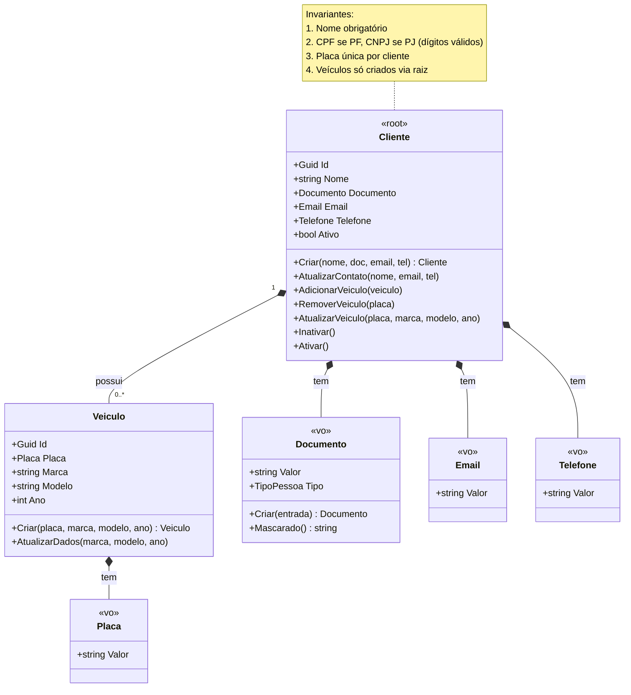
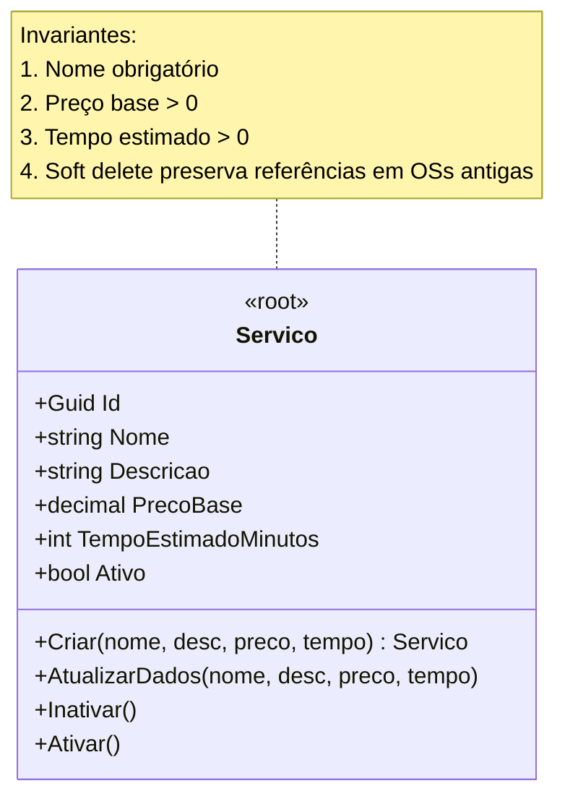
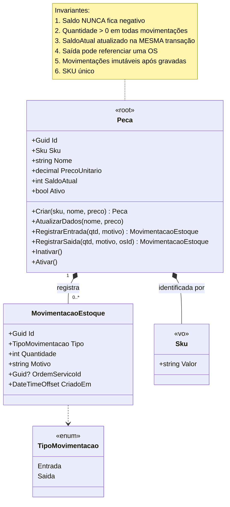
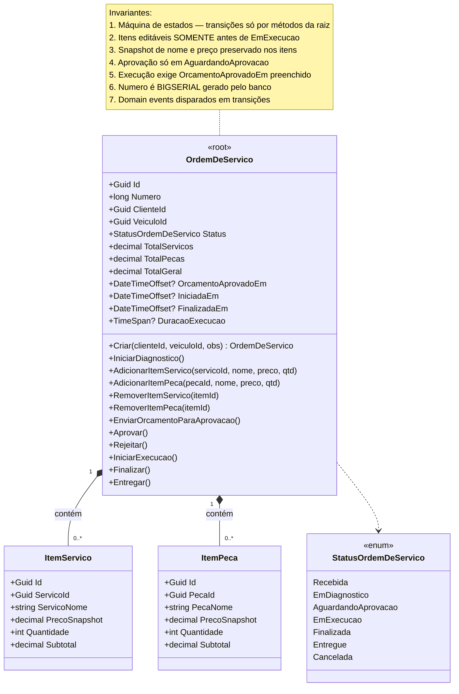
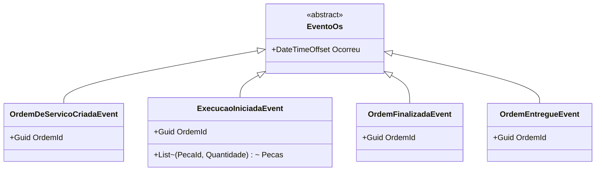
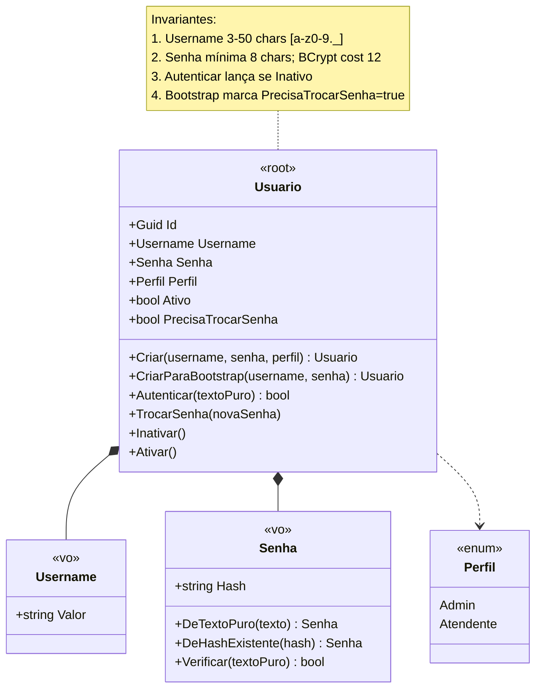

# Diagramas de Agregados

## 1. Agregado `Cliente` (Gestão de Clientes)

---

## 2. Agregado `Servico` (Catálogo de Serviços)

Agregado simples — sem entidades internas. Toda mutação passa pela raiz.

---

## 3. Agregado `Peca` (Estoque)

**Política central do contexto:** `RegistrarSaida` falha com `SaldoInsuficienteException` se `quantidade > SaldoAtual`.

---

## 4. Agregado `OrdemDeServico` (Núcleo) ⭐

**Eventos de domínio emitidos:**

---

## 5. Agregado `Usuario` (Auth — módulo técnico)

Não é um bounded context de negócio, mas estruturalmente segue o mesmo padrão de agregado.

---

## Resumo: regras de design dos agregados

| Regra | Aplicação no projeto |
|---|---|
| **Raiz é única porta de entrada** | Construtores das entidades internas (`Veiculo.Criar`, `ItemServico.Criar`) são `internal` |
| **Pequeno por padrão** | Cada agregado tem apenas o que precisa coexistir transacionalmente |
| **Referências por ID entre agregados** | `OrdemDeServico` referencia `ClienteId`/`VeiculoId`/`PecaId`/`ServicoId` como `Guid`, não navegação |
| **Snapshot quando necessário** | `ItemServico` e `ItemPeca` guardam cópia de `nome` e `preco` no momento da inclusão |
| **Eventos de domínio para integração** | OS dispara `ExecucaoIniciadaEvent`; handler cross-context baixa estoque |
| **Invariantes na raiz** | Saldo de Peça, máquina de estados de OS, unicidade de placa por cliente |
