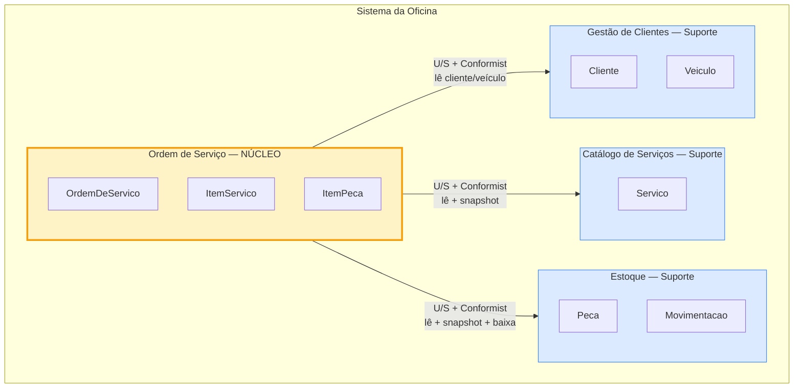
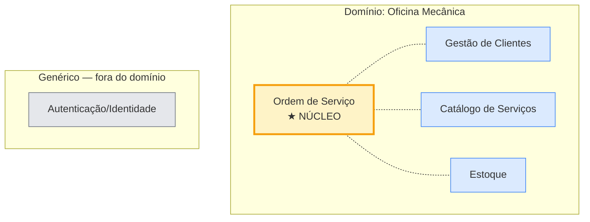

# Bounded Contexts e Context Map

## Visão geral dos contextos

Legenda: **U/S** = Upstream/Downstream (Customer/Supplier). **Conformist** = downstream aceita o modelo do upstream sem traduzir.

## Classificação de subdomínios

| Contexto | Tipo de subdomínio | Por quê |
|---|---|---|
| **Ordem de Serviço** | **Core (núcleo)** | É o coração competitivo da oficina — onde mora a complexidade (máquina de estados, snapshots, cross-context). Investimento maior em modelagem e testes. |
| **Gestão de Clientes** | Suporte | Necessário, mas não é diferencial competitivo. CRUD com validações de domínio. |
| **Catálogo de Serviços** | Suporte | Necessário para precificar. CRUD simples. |
| **Estoque** | Suporte | Necessário para controle, mas regra principal (saldo ≥ 0) é genérica. Em outra oficina poderia virar Core; aqui é suporte. |
| **Autenticação (módulo técnico)** | Genérico | Identidade/login — qualquer aplicação tem; não é parte do domínio da oficina. |

