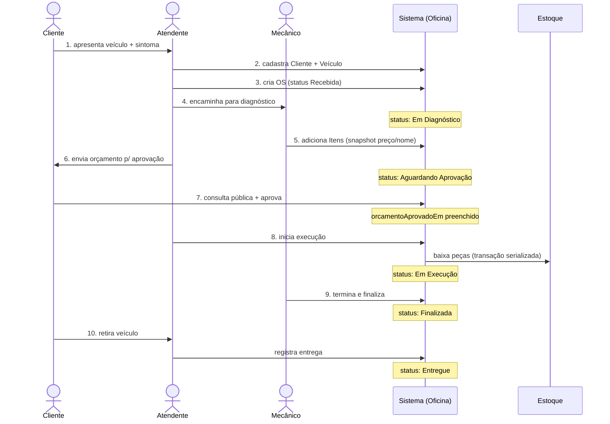
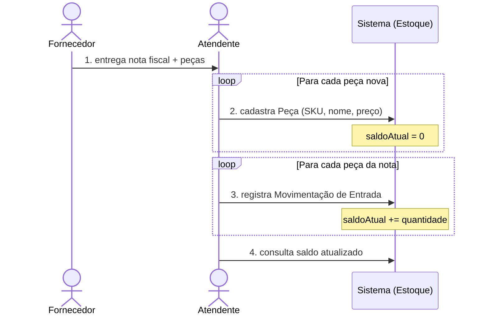
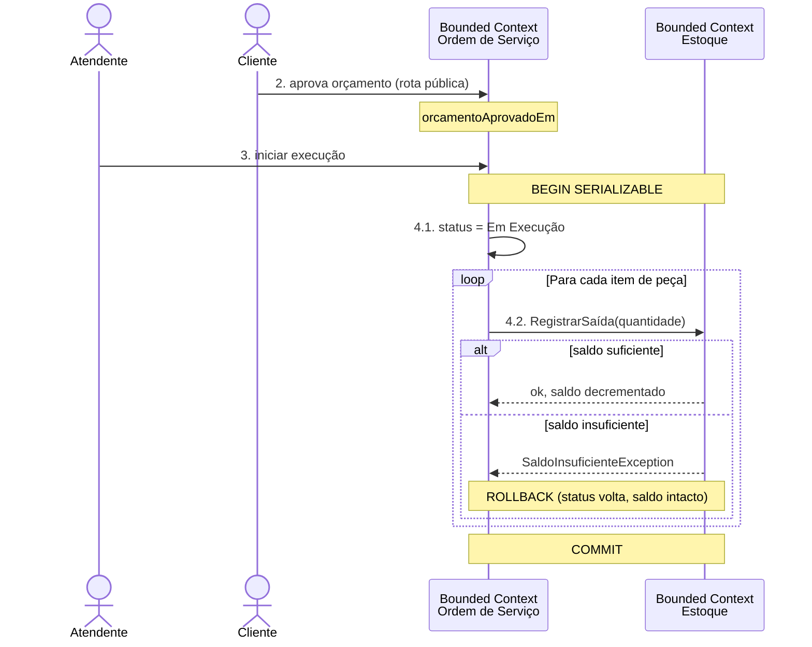

# Domain Storytelling

## História 1 — Cliente leva o veículo à oficina e o retira

**Cenário principal (happy path):** cliente PF deixa o carro, oficina diagnostica, aprova orçamento, executa, entrega.

### Storyline (sujeito → verbo → objeto)

1. **Cliente** *apresenta* `Veículo` e *informa* o problema (sintoma) ao **Atendente**.
2. **Atendente** *cadastra* o `Cliente` (se ainda não existir, via CPF/CNPJ) e *vincula* o `Veículo` (placa, marca, modelo, ano).
3. **Atendente** *cria* uma `Ordem de Serviço` (status: `Recebida`) com observações iniciais.
4. **Atendente** *encaminha* a `OS` para o **Mecânico** para diagnóstico (status: `Em Diagnóstico`).
5. **Mecânico** *adiciona* `Itens de Serviço` (ex: troca de óleo) e `Itens de Peça` (ex: filtro) ao `Orçamento` — cada item guarda **snapshot** do preço/nome do catálogo.
6. **Atendente** *envia* o `Orçamento` ao **Cliente** para aprovação (status: `Aguardando Aprovação`).
7. **Cliente** *acessa* o `Sistema de Consulta` (rota pública, usando `Número da OS` + `Documento`) e *aprova* o orçamento.
8. **Atendente** *inicia* a execução (status: `Em Execução`) — o `Sistema` automaticamente *baixa* as `Peças` do `Estoque` (dentro de transação serializada).
9. **Mecânico** *executa* os serviços; ao terminar, **Atendente** *finaliza* a `OS` (status: `Finalizada`).
10. **Cliente** *retira* o `Veículo`; **Atendente** *registra* a entrega (status: `Entregue`).

### Diagrama de sequência

### Caminho alternativo — rejeição do orçamento

A partir do passo 7:
- **Cliente** *rejeita* o `Orçamento` → `OS` passa a `Cancelada`; veículo é devolvido sem cobrança.

---

## História 2 — Atendente cadastra peça e recebe estoque

**Cenário principal:** atendente cadastra uma nova peça no catálogo de estoque e registra a entrada da primeira compra.

### Storyline

1. **Atendente** *recebe* uma `Nota Fiscal` do **Fornecedor** com peças compradas.
2. Para cada peça **nova** no catálogo:
   - **Atendente** *cadastra* a `Peça` no `Estoque` (SKU, nome, preço unitário) — saldo inicia em zero.
3. Para cada peça (nova ou existente):
   - **Atendente** *registra* uma `Movimentação de Entrada` (quantidade + motivo "Compra fornecedor X").
   - O `Sistema` *incrementa* o `Saldo Atual` da peça (transacional).
4. **Atendente** *verifica* o saldo atualizado.

### Diagrama de sequência

### Caminho alternativo — peça inativada

- Se uma peça **deixou de ser vendida** mas tem histórico em OSs antigas:
  - **Atendente** *inativa* a `Peça` (soft delete) — não aparece em novos orçamentos mas preserva referências.

---

## História 3 — Cliente aprova orçamento e oficina executa

**Cenário-chave:** detalhe do passo 7-8 da História 1, mostrando o evento `ExecuçãoIniciada` da OS disparando a saída no Estoque.

### Storyline

1. **Atendente** *envia* `Orçamento` (status `Aguardando Aprovação`).
2. **Cliente** *aprova* via API pública (`OrcamentoAprovado`).
3. **Atendente** *solicita* o início da execução.
4. `Sistema` valida que o orçamento está aprovado, abre **transação serializada**:
   - 4.1. *Muda* status da `OS` para `Em Execução`.
   - 4.2. Para cada `Item de Peça`, *carrega* a `Peça` e *registra* uma `Movimentação de Saída` (motivo: "OS #número").
   - 4.3. Se qualquer `Saldo` ficar insuficiente → exceção → **rollback automático** (OS volta a `Aguardando Aprovação`, saldos intactos).
5. Se tudo OK → *commit* da transação → **eventos** `ExecuçãoIniciada` e `SaídaDeEstoqueRegistrada` ficam consistentes.

### Diagrama de sequência

---

## Atores do domínio

| Ator | Papel | Onde aparece |
|---|---|---|
| **Cliente** | dono do veículo; aprova/rejeita orçamento | Histórias 1, 3 |
| **Atendente** | recepção, cadastro, encaminhamento, fechamento | Todas |
| **Mecânico** | diagnóstico e execução técnica | Histórias 1, 3 |
| **Fornecedor** | externo; entrega peças | História 2 |
| **Sistema** | aplica regras de domínio (invariantes, transações) | Todas |

## Artefatos do domínio

| Artefato | Contexto | Ciclo de vida |
|---|---|---|
| `Cliente` | Gestão de Clientes | criado uma vez; pode ser inativado |
| `Veículo` | Gestão de Clientes (interno) | vinculado a cliente; placa única por cliente |
| `Serviço` | Catálogo | CRUD admin; soft delete |
| `Peça` | Estoque | CRUD admin; saldo nunca negativo |
| `Movimentação de Estoque` | Estoque (interno) | imutável uma vez registrada |
| `Ordem de Serviço` | OS | máquina de estados linear; preserva histórico via snapshot |
| `Item de Serviço` / `Item de Peça` | OS (interno) | editável até `Em Execução` |
| `Orçamento` | OS (calculado) | derivado dos itens; aprovado pelo cliente |

