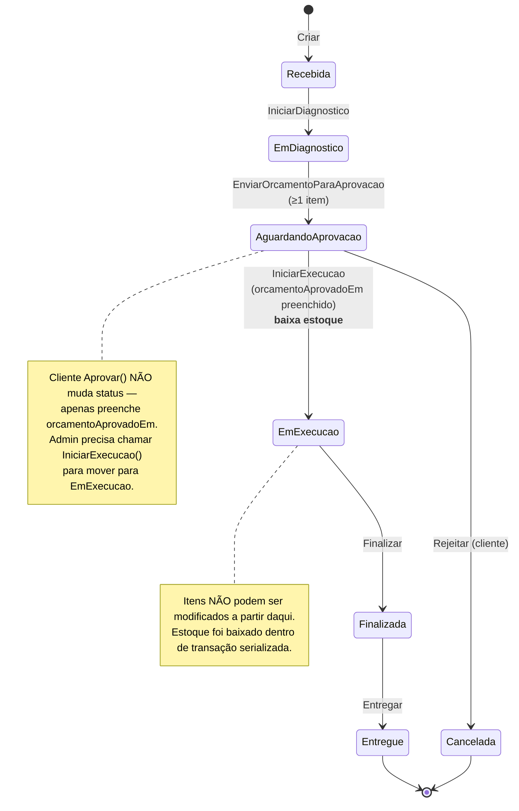

# Máquina de Estados — Ordem de Serviço

## Diagrama

## Tabela detalhada de transições

| Origem | Comando | Destino | Ator | Pré-condições | Evento emitido |
|---|---|---|---|---|---|
| _(inexistente)_ | `Criar(clienteId, veiculoId)` | `Recebida` | Atendente | Cliente ativo; veículo pertence ao cliente | `OrdemDeServicoCriada` |
| `Recebida` | `IniciarDiagnostico()` | `EmDiagnostico` | Atendente/Mecânico | status == Recebida | — (apenas mudança de status) |
| `EmDiagnostico` | `AdicionarItemServico(...)` | _(mesmo)_ | Mecânico | status ≠ EmExecucao+ | — |
| `EmDiagnostico` | `AdicionarItemPeca(...)` | _(mesmo)_ | Mecânico | status ≠ EmExecucao+ | — |
| `EmDiagnostico` | `RemoverItemServico(itemId)` | _(mesmo)_ | Mecânico | item existe; status ≠ EmExecucao+ | — |
| `EmDiagnostico` | `RemoverItemPeca(itemId)` | _(mesmo)_ | Mecânico | item existe; status ≠ EmExecucao+ | — |
| `EmDiagnostico` | `EnviarOrcamentoParaAprovacao()` | `AguardandoAprovacao` | Atendente | ≥ 1 item | `OrcamentoEnviadoParaAprovacao` |
| `AguardandoAprovacao` | `Aprovar()` | _(mesmo status, marca aprovação)_ | **Cliente** (API pública) | status == AguardandoAprovacao | `OrcamentoAprovado` |
| `AguardandoAprovacao` | `Rejeitar()` | `Cancelada` | **Cliente** (API pública) | status == AguardandoAprovacao | `OrcamentoRejeitado` |
| `AguardandoAprovacao` | `IniciarExecucao()` | `EmExecucao` | Atendente | `OrcamentoAprovadoEm` preenchido | `ExecucaoIniciada` |
| `EmExecucao` | `Finalizar()` | `Finalizada` | Mecânico | status == EmExecucao | `OrdemFinalizada` |
| `Finalizada` | `Entregar()` | `Entregue` | Atendente | status == Finalizada | `OrdemEntregue` |

> **Notação "≠ EmExecucao+"** = qualquer status anterior a `EmExecucao` (ou seja, `Recebida` ou `EmDiagnostico`). A invariante `GarantirEditavel()` rejeita modificações em `EmExecucao`, `Finalizada`, `Entregue` e `Cancelada`.

## Transições inválidas (exemplos)

Qualquer comando chamado fora do estado esperado lança `TransicaoDeStatusInvalidaException` (HTTP 422). Exemplos:

- `IniciarDiagnostico()` em `EmDiagnostico` → erro
- `EnviarOrcamentoParaAprovacao()` em `Recebida` (pulando diagnóstico) → erro
- `EnviarOrcamentoParaAprovacao()` em `EmDiagnostico` sem itens → `OrdemSemItensException`
- `IniciarExecucao()` em `AguardandoAprovacao` sem `OrcamentoAprovadoEm` → `OrcamentoNaoAprovadoException`
- `Finalizar()` em `Recebida` (pulando estados) → erro
- `Aprovar()` em `Recebida` → erro
- `AdicionarItemPeca(...)` em `EmExecucao` → `OrdemImutavelException`

## Timestamps registrados em cada transição

| Transição | Coluna preenchida no banco |
|---|---|
| `Criar` | `criada_em` |
| `IniciarDiagnostico` | `diagnosticada_em` |
| `EnviarOrcamentoParaAprovacao` | `enviada_aprovacao_em` |
| `Aprovar` (cliente) | `orcamento_aprovado_em` |
| `Rejeitar` (cliente) | `orcamento_rejeitado_em` |
| `IniciarExecucao` | `iniciada_em` |
| `Finalizar` | `finalizada_em` |
| `Entregar` | `entregue_em` |

`DuracaoExecucao` é calculada como `FinalizadaEm - IniciadaEm` (usado pela métrica administrativa de tempo médio).

## Caminhos possíveis (do início ao fim)

**Caminho feliz (entrega):**
`Recebida → EmDiagnostico → AguardandoAprovacao → EmExecucao → Finalizada → Entregue`

**Caminho de rejeição (cliente não aprova):**
`Recebida → EmDiagnostico → AguardandoAprovacao → Cancelada`

Não há outros terminais. **Não existe** "voltar atrás" — a máquina é estritamente avante. Em produção, retrabalho exige cancelar a OS atual e criar uma nova.

## Onde isso está implementado

- Agregado: [`src/Oficina.Dominio/OrdensServico/OrdemDeServico.cs`](../../src/Oficina.Dominio/OrdensServico/OrdemDeServico.cs)
- Enum: [`src/Oficina.Dominio/OrdensServico/StatusOrdemDeServico.cs`](../../src/Oficina.Dominio/OrdensServico/StatusOrdemDeServico.cs)
- Exceções: [`src/Oficina.Dominio/OrdensServico/ExcecoesOrdemServico.cs`](../../src/Oficina.Dominio/OrdensServico/ExcecoesOrdemServico.cs)
- Testes (21 cenários cobrindo todas as transições): [`tests/Oficina.Dominio.Testes/OrdensServico/OrdemDeServicoTestes.cs`](../../tests/Oficina.Dominio.Testes/OrdensServico/OrdemDeServicoTestes.cs)
