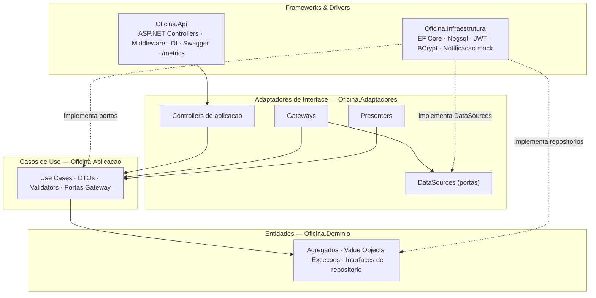
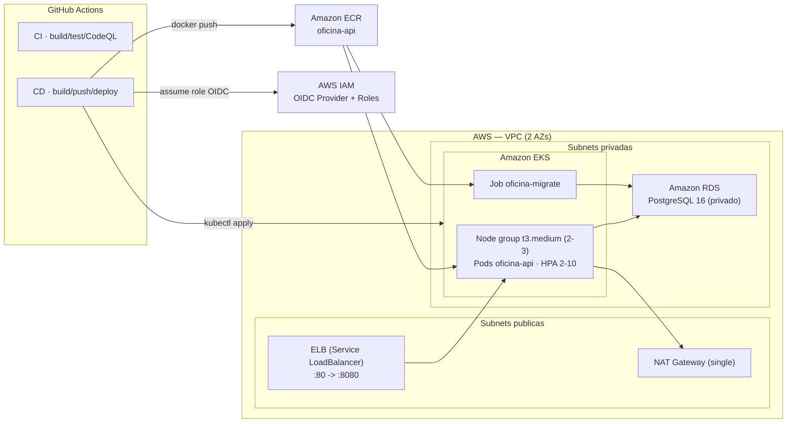
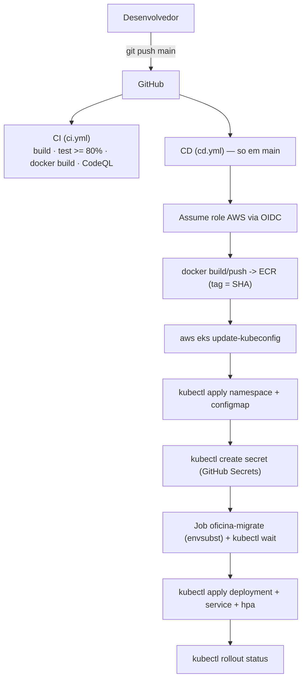

# Plano 12 — Documentação e Entrega da Fase 2 (último plano)

## For agentic workers

- **Escopo:** SOMENTE documentação e a pasta `http/` (+ `.vscode/settings.json`, que é config do REST Client, não código). **NENHUM arquivo `.cs`, `.csproj`, `.tf`, `.yaml` de k8s/CI ou `docker-compose` é alterado.**
- **Branch:** `fase-2`. **Não** fazer merge nem push — apenas commits locais.
- **Idioma:** pt-BR em todo conteúdo (o README já é pt-BR; manter).
- **Fidelidade:** os documentos DEVEM refletir o que está de fato implementado no branch `fase-2` (não a spec). Este plano já embute o conteúdo final verificado contra o código — copie os blocos verbatim.
- **Bash tool = Git Bash** (comandos de verificação usam sintaxe POSIX).
- **Gate:** `dotnet build` continua com 0 erros (não muda porque nada de código é tocado) e os greps de verificação passam.
- **Sem segredo real** nos docs: só placeholders (`<...>`, `troque-por-...`).
- Dois commits (um por Task), mensagens pt-BR terminando com o trailer `Co-Authored-By: Claude Opus 4.8 (1M context) <noreply@anthropic.com>`.

## Goal

Consolidar a entrega da Fase 2: reescrever o `README.md` (com 3 diagramas Mermaid renderáveis no GitHub), criar 5 novos ADRs (009–013), atualizar o `CLAUDE.md` (5 projetos + camadas de adaptadores + comandos de infra + mudanças de API), atualizar os cenários `http/` para o novo contrato (abertura consolidada, webhook de aprovação, consulta só-GET), e produzir os entregáveis (`roteiro-video-fase2.md` e `__ENTREGA-fase2.md`).

## Architecture (estado REAL verificado no branch `fase-2`)

**5 projetos** sob `src/` (Clean Architecture estilo SOAT):

```
Oficina.Api ─► Oficina.Aplicacao ─► Oficina.Dominio
Oficina.Api ─► Oficina.Adaptadores ─► Oficina.Aplicacao
Oficina.Api ─► Oficina.Infraestrutura ─► {Dominio, Aplicacao, Adaptadores}
```

Referências de projeto confirmadas nos `.csproj`:
- `Oficina.Dominio` → nada (puro).
- `Oficina.Aplicacao` → `Dominio`. Define **portas Gateway** (interfaces), ex.: `OrdensServico/Gateways/IOrdemDeServicoGateway.cs`, `INotificacaoGateway.cs`.
- `Oficina.Adaptadores` → `Aplicacao`. Contém **Controllers de aplicação** (orquestram use cases + Presenter), **Gateways** (implementam as portas da Aplicação, apoiados em DataSources), **Presenters** (formatam domínio → DTO de resposta) e **DataSources** (interfaces de acesso a dados — `IOrdemDeServicoDataSource`, `OrdemDeServicoQuery` com filtro/ordenação puros). Sub-pasta extra `OrdensServico/Webhooks/ValidadorTokenWebhook.cs`.
- `Oficina.Infraestrutura` → `Dominio` + `Aplicacao` + `Adaptadores`. Implementa `OficinaDbContext` (EF Core/Npgsql), os **DataSources** (`Persistencia/DataSources/*`), JWT, BCrypt, `IInicializadorBanco`, `BootstrapAdminHostedService` e `NotificacaoEmailMock` (`Notificacoes/NotificacaoEmailMock.cs`, log estruturado — porta `INotificacaoGateway`).
- `Oficina.Api` → `Aplicacao` + `Infraestrutura` + `Adaptadores` (wiring de DI). Controllers ASP.NET finos que delegam ao Controller de aplicação; `Program.cs` registra `AdicionarAdaptadores()`, `AdicionarWebhook(...)`, OpenTelemetry `/metrics` (Prometheus) e o modo Job de migração (`args "migrate"` ou `STARTUP_TASK=migrate`).

Infra Fase 2 (fonte da verdade — NÃO alterar, só documentar): `infra/` (Terraform: VPC/EKS/RDS/ECR/OIDC/metrics-server, state S3+DynamoDB), `k8s/` (namespace, configmap, secret template, migration-job, deployment 2 réplicas, service LoadBalancer, hpa 2–10), `.github/workflows/{ci,cd,infra}.yml`, `docker/docker-compose.yml`.

**Mudanças de API já implementadas (verificadas):**
- `POST /api/v1/ordens-servico` recebe `AbrirOrdemRequest` **consolidado** (`clienteDados` + `veiculoDados` + `servicos[]` + `pecas[]` + `observacoes?`); find-or-create de cliente (por documento) e veículo (por placa) numa única unidade de trabalho; validação exige ≥1 item. Retorna `OrdemResponse` (com `id`, `numero` BIGSERIAL).
- `GET /api/v1/ordens-servico` **ordenado** por prioridade da fila (EmExecucao→AguardandoAprovacao→EmDiagnostico→Recebida) e depois `criadaEm` asc; sem filtro, esconde OS terminais (Finalizada/Entregue/Cancelada).
- **Webhook de aprovação:** `POST /api/v1/ordens-servico/{id}/orcamento/aprovacao` (`WebhooksController`, `[AllowAnonymous]`), autenticado por header **`X-Webhook-Token`** validado em tempo constante (`ValidacaoTokenWebhookFilter` → 401 antes do model binding; fail-closed sem token). Body: `{ "decisao": "aprovado" | "recusado" }` (senão 422). `aprovado`→`Aprovar()`, `recusado`→`Rejeitar()` (cancela). Notifica via `INotificacaoGateway` (mock e-mail).
- `ConsultaController` agora é **só GET** (`GET /api/v1/consulta/{numeroOs}?documento=...`, anti-enumeração 404 idêntico); os POSTs públicos de aprovar/rejeitar **foram removidos** (substituídos pelo webhook).
- Máquina de estados (enum `StatusOrdemDeServico`): `Recebida(1) → EmDiagnostico(2) → AguardandoAprovacao(3) → EmExecucao(4) → Finalizada(5) → Entregue(6)`, com `Cancelada(7)` via rejeição.

## Tech Stack (documentação)

Markdown (GitHub-flavored), Mermaid (renderizado nativamente pelo GitHub em blocos ```mermaid), arquivos `.http` (REST Client — variáveis em `.vscode/settings.json`, pois **`http/_env.http` NÃO existe**). ADRs seguem o formato dos existentes (`# ADR-NNN — Título`, `**Status:** Aceita`, `**Data:** ...`, seções `## Contexto` / `## Decisão` / `## Consequências` com bullets ✅/⚠️).

## Global Constraints

1. pt-BR em todo o conteúdo.
2. Diagramas Mermaid válidos (sintaxe conservadora: `flowchart`, `subgraph "..."`, labels entre aspas, `<br/>` só dentro de aspas) — renderizam no GitHub.
3. Docs FIÉIS ao implementado — proibido afirmar recursos inexistentes (ex.: NÃO citar approve/reject público; NÃO citar `_env.http`; citar 5 projetos, não 4).
4. NENHUM código C# / infra alterado — `dotnet build` segue 0 erros.
5. Sem segredo real (só placeholders).
6. Um commit por Task, trailer `Co-Authored-By: Claude Opus 4.8 (1M context) <noreply@anthropic.com>`; branch `fase-2`, sem push/merge.

---

## Estrutura de arquivos

```
README.md                                            (M) reescrito p/ Fase 2 + 3 diagramas Mermaid
CLAUDE.md                                            (M) 5 projetos + adaptadores + infra + API
docs/arquitetura/ADR-009-refatoracao-clean-architecture.md   (A)
docs/arquitetura/ADR-010-aws-eks-rds-terraform.md            (A)
docs/arquitetura/ADR-011-webhook-aprovacao-token.md          (A)
docs/arquitetura/ADR-012-migracao-via-job-kubernetes.md      (A)
docs/arquitetura/ADR-013-observabilidade-minima.md           (A)
http/ordens-servico.http                             (M) payload consolidado AbrirOrdemRequest + listagem
http/webhook-aprovacao.http                          (A) POST .../orcamento/aprovacao + X-Webhook-Token
http/consulta.http                                   (M) remove POST aprovar/rejeitar (só GET)
http/demo-video.http                                 (M) roteiro alinhado ao novo fluxo
.vscode/settings.json                                (M) + variáveis webhookToken e numeroOs
docs/entrega/roteiro-video-fase2.md                  (A) roteiro do vídeo (deploy, CI/CD, APIs, HPA)
docs/entrega/__ENTREGA-fase2.md                      (A) fonte Markdown do PDF de entrega
```

Legenda: (A) adicionar, (M) modificar.

---

## Task 1 — README (Fase 2 + 3 diagramas Mermaid), ADRs 009–013 e CLAUDE.md

### Passo 1.1 — Reescrever `README.md`

Substituir TODO o conteúdo de `README.md` pelo bloco abaixo (verbatim). Ele mantém a stack, como-rodar-testes e estrutura de pastas atualizados para 5 projetos + `k8s/` + `infra/`, com os 3 diagramas Mermaid.

````markdown
# Oficina Mecânica — Sistema Integrado de Atendimento e Execução de Serviços

> **Tech Challenge — Fase 2 — Pós-Tech FIAP (15SOAT)**

Back-end de uma oficina mecânica de médio porte. O sistema unifica gestão de clientes, veículos, catálogo de serviços, controle de estoque e o ciclo completo da Ordem de Serviço (OS) — da entrada do veículo à entrega.

A **Fase 2** evolui o MVP da Fase 1 com foco em **qualidade, resiliência e escalabilidade**: refatoração para **Clean Architecture** (Controllers/Gateways/Presenters/DataSources de aplicação), empacotamento e orquestração em **Kubernetes (AWS EKS)** com **RDS PostgreSQL** provisionados por **Terraform**, pipeline **CI/CD** com deploy contínuo via **OIDC**, **escalabilidade horizontal automática (HPA)** e **observabilidade mínima** (`/metrics`).

---

## Funcionalidades

- ✅ **Gestão de Clientes** (PF/PJ) e seus **veículos**
- ✅ **Catálogo de serviços** com preço base e tempo estimado
- ✅ **Controle de estoque** de peças com saldo, entradas e saídas
- ✅ **Abertura consolidada de OS** (cliente + veículo + serviços + peças em uma requisição, atômica)
- ✅ **Ordem de Serviço** com máquina de estados (Recebida → Em Diagnóstico → Aguardando Aprovação → Em Execução → Finalizada → Entregue; Cancelada via rejeição)
- ✅ **Webhook de aprovação de orçamento** autenticado por token (`X-Webhook-Token`)
- ✅ **Consulta pública** do orçamento pelo cliente (sem JWT, anti-enumeração)
- ✅ **Notificação de mudança de status** (mock de e-mail em log estruturado)
- ✅ **Baixa automática de estoque** ao iniciar a execução (transacional)
- ✅ **Métricas administrativas** — tempo médio de execução
- ✅ **Autenticação JWT** para usuários administrativos (perfis Admin/Atendente)
- ✅ **Validação de CPF/CNPJ e placa** (formatos antigo e Mercosul)
- ✅ **Documentação Swagger** em `/swagger` e **métricas Prometheus** em `/metrics`

---

## Stack tecnológica

| Camada | Tecnologia |
|---|---|
| Linguagem | C# 12 / .NET 8 |
| Web | ASP.NET Core (controllers + minimal hosting) |
| ORM | Entity Framework Core 8 + Npgsql |
| Banco | PostgreSQL 16 (local via Docker; AWS RDS em produção) |
| Auth | JWT HS256 + BCrypt + RateLimiting nativo |
| Validação | FluentValidation |
| Observabilidade | Serilog (Console JSON) + OpenTelemetry (`/metrics` Prometheus) |
| Testes | xUnit + FluentAssertions + Moq + Coverlet + Testcontainers |
| Container | Docker multi-stage + docker-compose |
| Orquestração | Kubernetes (AWS EKS), HPA |
| Infra como código | Terraform (VPC, EKS, RDS, ECR, OIDC) |
| CI/CD | GitHub Actions (OIDC) + CodeQL + Dependabot |

### Por que PostgreSQL?

Domínio fortemente relacional (cliente↔veículos↔OS↔itens↔peças), transações ACID essenciais para integridade de orçamento e estoque, schemas separados reforçando bounded contexts, suporte nativo a `BIGSERIAL` para o número humano-amigável da OS, gratuito e maduro. Em produção roda como **AWS RDS PostgreSQL 16**.

---

## Arquitetura

### 1. Camadas (Clean Architecture — 5 projetos)

A regra de dependência aponta **sempre para dentro** (em direção ao Domínio). A Infraestrutura implementa as portas declaradas nas camadas internas.



Diagramas de DDD (contextos, agregados, máquina de estados) em [docs/entrega](docs/entrega).

### 2. Infraestrutura AWS



Estado do Terraform em **S3 + DynamoDB**. Detalhes e custo em [infra/README.md](infra/README.md) e [k8s/README.md](k8s/README.md).

### 3. Fluxo de deploy (CI/CD)



### Componentes da aplicação

| Projeto | Responsabilidade |
|---|---|
| `Oficina.Dominio` | Entidades/agregados, value objects, exceções e interfaces de repositório. Sem dependências externas. |
| `Oficina.Aplicacao` | Casos de uso, DTOs, validators (FluentValidation) e **portas Gateway**. |
| `Oficina.Adaptadores` | **Controllers de aplicação**, **Gateways**, **Presenters** e **DataSources** (portas de dados). Adapta os casos de uso ao mundo externo. |
| `Oficina.Infraestrutura` | EF Core (`OficinaDbContext`, migrations), implementação dos DataSources, JWT, BCrypt, inicializador de banco e notificação (mock). |
| `Oficina.Api` | Host ASP.NET Core: controllers finos, middleware, DI, Swagger, `/metrics`, modo Job de migração. |

### Bounded Contexts

| Contexto | Tipo | Agregado raiz |
|---|---|---|
| Gestão de Clientes | Suporte | `Cliente` (com `Veiculo`) |
| Catálogo de Serviços | Suporte | `Servico` |
| Estoque | Suporte | `Peca` (com `MovimentacaoEstoque`) |
| Ordem de Serviço | **Núcleo** | `OrdemDeServico` (com `ItemServico`, `ItemPeca`) |

### Infraestrutura provisionada (Terraform)

VPC (2 AZs, subnets públicas/privadas, NAT único), **EKS** (1 node group `t3.medium`, addons, access entry para o CI), **RDS PostgreSQL 16** (`db.t3.micro`, privado), **ECR** (`oficina-api`, scan on push), **OIDC** do GitHub Actions (roles de deploy e de infra), **metrics-server** (Helm, para o HPA). Estado remoto em **S3 + DynamoDB**.

---

## Como rodar localmente

### Pré-requisitos

- Docker + docker compose
- (Opcional) .NET 8 SDK para rodar fora do container

### 1. Clonar e configurar

```bash
git clone https://github.com/lcr-thiago-fernandes/fiap_15SOAT_fase1
cd fiap_15SOAT_fase1
cp .env.example .env   # ajuste ADMIN_BOOTSTRAP_PASSWORD, JWT_SECRET (>=64 chars), WEBHOOK_TOKEN
```

### 2. Subir o ambiente

```bash
docker compose -f docker/docker-compose.yml --env-file .env up -d --build
```

A primeira execução aplica todas as migrations no Postgres e cria o usuário `admin` (senha = `ADMIN_BOOTSTRAP_PASSWORD`, exige troca no primeiro login).

### 3. Acessar

- **API**: http://localhost:8080
- **Swagger**: http://localhost:8080/swagger
- **Health**: http://localhost:8080/health
- **Métricas (Prometheus)**: http://localhost:8080/metrics

### 4. Login

```bash
curl -X POST http://localhost:8080/api/v1/auth/login \
  -H "Content-Type: application/json" \
  -d '{"username":"admin","password":"<sua-senha>"}'
```

Use o `accessToken` no header `Authorization: Bearer ...` nas chamadas administrativas.

---

## Deploy em Kubernetes (AWS EKS)

Há dois caminhos: **CD automático** (push em `main` dispara `cd.yml`) ou **manual**. O manual:

```bash
# 1) Provisionar a infra (Terraform) — ver "Provisionamento (Terraform)" abaixo
# 2) Apontar o kubeconfig para o cluster
aws eks update-kubeconfig --region us-east-1 --name $(terraform -chdir=infra output -raw cluster_name)

# 3) Aplicar os manifestos NA ORDEM (o Secret real é criado a partir de segredos, não do template)
kubectl apply -f k8s/namespace.yaml
kubectl apply -f k8s/configmap.yaml
kubectl apply -f k8s/secret.yaml          # template; no deploy real use kubectl create secret (ver k8s/README.md)
kubectl apply -f k8s/migration-job.yaml   # migra + bootstrap
kubectl wait --for=condition=complete job/oficina-migrate -n oficina --timeout=300s
kubectl apply -f k8s/deployment.yaml      # só após o Job concluir
kubectl apply -f k8s/service.yaml
kubectl apply -f k8s/hpa.yaml             # requer metrics-server
```

Detalhes completos (probes, HPA, securityContext, migração vs. startup) em [k8s/README.md](k8s/README.md).

## Provisionamento (Terraform)

```bash
# Bootstrap do backend (UMA vez): bucket S3 + tabela DynamoDB — ver infra/README.md
cd infra
export TF_VAR_db_password='<senha-forte-do-rds>'
terraform init
terraform plan
terraform apply     # ~15-20 min (EKS)
# ... demo ...
terraform destroy   # remova antes o Service LoadBalancer para não deixar ELB órfão
```

Recursos, pré-requisitos e estimativa de custo em [infra/README.md](infra/README.md).

### GitHub Secrets e Variables exigidos pelo CI/CD

Configurar em *Settings → Secrets and variables → Actions* antes de rodar `cd.yml`/`infra.yml`.

**Secrets (sensíveis — nunca ecoados):**

| Secret | Usado em | Origem / valor |
|---|---|---|
| `AWS_ROLE_ARN` | `cd.yml` | output `github_actions_role_arn` do Terraform (role OIDC de deploy) |
| `AWS_TERRAFORM_ROLE_ARN` | `infra.yml` | role admin (opcional — só se usar o `infra.yml`) |
| `DB_USER` | `cd.yml`, `infra.yml` | usuário do RDS (`ConnectionStrings__Default` / `TF_VAR_db_username`) |
| `DB_PASSWORD` | `cd.yml`, `infra.yml` | senha do RDS (`ConnectionStrings__Default` / `TF_VAR_db_password`) |
| `RDS_ENDPOINT` | `cd.yml` | output `rds_endpoint` (host da connection string) |
| `JWT_SECRET` | `cd.yml` | ≥64 chars (HS256) → `Jwt__Secret` |
| `ADMIN_BOOTSTRAP_PASSWORD` | `cd.yml` | senha do admin de bootstrap → `AdminBootstrap__Password` |
| `WEBHOOK_TOKEN` | `cd.yml` | token do webhook → `Webhook__Token` |

**Variables (não sensíveis):**

| Variable | Usado em | Valor típico |
|---|---|---|
| `AWS_REGION` | `cd.yml`, `infra.yml` | `us-east-1` |
| `EKS_CLUSTER_NAME` | `cd.yml` | output `cluster_name` (`oficina-eks`) |
| `ECR_REPOSITORY` | `cd.yml` | output `ecr_repository_url` (URL completa) |

> `Jwt__Issuer`/`Jwt__Audience` são valores literais não sensíveis no `k8s/configmap.yaml` (não injetados pelos workflows).

---

## Coleção de APIs (Swagger + `http/`)

A coleção de requisições é dupla:

- **Swagger UI** (OpenAPI): http://localhost:8080/swagger — explorável e testável no navegador (Development).
- **Cenários `.http`** (pasta [`http/`](http/)), executáveis pela extensão REST Client (VS Code), Visual Studio ou Rider:
  - `auth.http` — login, rate limit
  - `clientes.http` — CRUD cliente + veículos
  - `servicos.http` — CRUD catálogo
  - `pecas.http` — CRUD peça + movimentações
  - `ordens-servico.http` — abertura consolidada + fluxo completo da OS
  - `webhook-aprovacao.http` — aprovação/recusa do orçamento via webhook (`X-Webhook-Token`)
  - `consulta.http` — consulta pública do orçamento (cliente, sem JWT)
  - `demo-video.http` — roteiro fim-a-fim para a demonstração

As variáveis (`baseUrl`, `token`, `webhookToken`, IDs) ficam em [`.vscode/settings.json`](.vscode/settings.json) (`rest-client.environmentVariables`). Selecione o ambiente **local** no canto inferior do VS Code.

## Vídeo de demonstração

📹 **Link do vídeo (YouTube/Vimeo, ≤15 min):** `<INSERIR-LINK-DO-VIDEO>`

Roteiro em [docs/entrega/roteiro-video-fase2.md](docs/entrega/roteiro-video-fase2.md).

---

## Como rodar testes

```bash
# Todos os testes (unit + integração)
dotnet test

# Com cobertura
dotnet test --collect:"XPlat Code Coverage" --settings coverlet.runsettings

# Relatório HTML
dotnet tool install -g dotnet-reportgenerator-globaltool
reportgenerator -reports:"**/TestResults/**/coverage.cobertura.xml" \
                -targetdir:"TestResults/CoverageReport" \
                -reporttypes:"HtmlInline;TextSummary"
```

Os testes de integração usam **Testcontainers** (Postgres real efêmero, sem mocks) e exigem Docker. **Cobertura mínima exigida pelo CI:** 80% (`.github/workflows/ci.yml`).

---

## Estrutura de pastas

```
fiap_15SOAT_fase1/
├── .github/workflows/    # ci.yml, cd.yml, infra.yml + Dependabot
├── docker/               # Dockerfile + docker-compose
├── docs/
│   ├── arquitetura/      # ADRs (001-013)
│   └── entrega/          # entregáveis do Tech Challenge
├── http/                 # cenários REST Client
├── infra/                # Terraform (VPC, EKS, RDS, ECR, OIDC)
├── k8s/                  # manifestos Kubernetes
├── src/
│   ├── Oficina.Api/
│   ├── Oficina.Aplicacao/
│   ├── Oficina.Adaptadores/
│   ├── Oficina.Dominio/
│   └── Oficina.Infraestrutura/
└── tests/
    ├── Oficina.Dominio.Testes/
    ├── Oficina.Aplicacao.Testes/
    └── Oficina.Integracao.Testes/
```

---

## Segurança

- Senhas com BCrypt cost 12; JWT HS256, expiração 60 min, sem refresh token (MVP)
- Rate limit 5 tentativas / 15 min por IP no login
- Webhook de aprovação autenticado por token (`X-Webhook-Token`), comparação em tempo constante e fail-closed
- Validação de CPF/CNPJ (dígitos verificadores), placa (antigo + Mercosul), e-mail
- Saldo de peça nunca negativo (invariante + check constraint SQL)
- Anti-enumeração na consulta pública (404 idêntico para OS inexistente e documento não conferente)
- Segredos fora do código: `.env` local, GitHub Secrets + Kubernetes Secret em produção
- CI/CD 100% OIDC (sem chave estática); CodeQL + Dependabot ([relatório](docs/entrega/4 - Relatório com análise de vulnerabilidades.md))

---

## Licença

Projeto acadêmico — uso restrito ao Tech Challenge da FIAP.
````

> **Nota sobre Mermaid:** os três diagramas usam apenas `flowchart`, `subgraph "..."`, labels entre aspas e `<br/>` dentro de aspas — sintaxe suportada pelo renderizador do GitHub. Não usar parênteses fora de aspas em labels.

### Passo 1.2 — Criar `docs/arquitetura/ADR-009-refatoracao-clean-architecture.md`

```markdown
# ADR-009 — Refatoração para Clean Architecture (Controllers/Gateways/Presenters/DataSources)

**Status:** Aceita
**Data:** 2026-07-06

## Contexto

Na Fase 1 o sistema era Clean Architecture com 4 projetos (`Api`, `Aplicacao`, `Dominio`,
`Infraestrutura`), mas os controllers ASP.NET falavam direto com casos de uso e o
mapeamento entrada/saída ficava espalhado. A Fase 2 pede maior separação de
responsabilidades e testabilidade dos adaptadores de interface, no estilo apresentado
na disciplina (Controllers/Gateways/Presenters/DataSources).

## Decisão

Introduzimos um **5º projeto, `Oficina.Adaptadores`** (camada de Adaptadores de Interface),
entre `Api` e `Aplicacao`, com quatro blocos por bounded context:

- **Controllers de aplicação** — orquestram os casos de uso e formatam a saída via Presenter
  (ex.: `OrdemDeServicoController.AbrirAsync`). Não confundir com os controllers ASP.NET.
- **Gateways** — implementam as **portas Gateway** declaradas em `Oficina.Aplicacao`
  (ex.: `IOrdemDeServicoGateway`), apoiando-se em DataSources.
- **Presenters** — convertem agregados do domínio em DTOs de resposta.
- **DataSources** — **portas de acesso a dados** (interfaces, ex.: `IOrdemDeServicoDataSource`)
  implementadas na Infraestrutura. Regras de consulta puras (filtro/ordenação) ficam em
  classes testáveis (`OrdemDeServicoQuery`).

Regra de dependência (aponta sempre para dentro):

- `Dominio` → nada
- `Aplicacao` → `Dominio` (e define as portas Gateway)
- `Adaptadores` → `Aplicacao` (implementa portas; define portas DataSource)
- `Infraestrutura` → `Dominio` + `Aplicacao` + `Adaptadores` (implementa DataSources, repositórios e serviços)
- `Api` → `Aplicacao` + `Infraestrutura` + `Adaptadores` (apenas wiring de DI)

Os controllers ASP.NET em `Oficina.Api` ficam **finos**: recebem o request, delegam ao
Controller de aplicação (injetado via DI) e mapeiam o resultado para `IActionResult`.

## Consequências

- ✅ Separa claramente entrada/saída (Presenter) do fluxo de negócio (Use Case)
- ✅ Adaptadores testáveis isoladamente (Gateways/Query sem ASP.NET)
- ✅ Portas explícitas (Gateway na Aplicação, DataSource nos Adaptadores) reforçam a inversão de dependência
- ⚠️ Mais projetos e boilerplate (interfaces + implementações) que a versão de 4 camadas
- ⚠️ A Infraestrutura passa a referenciar `Adaptadores` para implementar os DataSources — dependência aceitável por estar na borda externa
```

### Passo 1.3 — Criar `docs/arquitetura/ADR-010-aws-eks-rds-terraform.md`

```markdown
# ADR-010 — Orquestração em AWS EKS + RDS via Terraform

**Status:** Aceita
**Data:** 2026-07-06

## Contexto

A Fase 2 exige empacotar a aplicação em contêiner, orquestrar em Kubernetes e provisionar
a infraestrutura como código, demonstrando escalabilidade. Era preciso escolher provedor
de nuvem, serviço de Kubernetes gerenciado, banco gerenciado e ferramenta de IaC.

## Decisão

Provisionar em **AWS** via **Terraform** (`infra/`):

- **Amazon EKS** — Kubernetes gerenciado (control plane + 1 node group `t3.medium`, 2–3 nós),
  addons e uma *access entry* concedendo admin do cluster ao role de CI.
- **Amazon RDS PostgreSQL 16** — `db.t3.micro`, single-AZ, privado (5432 só do SG dos nós).
- **Amazon ECR** — repositório `oficina-api` (scan on push, retém as 10 últimas imagens).
- **VPC** (módulo oficial) — 2 AZs, subnets públicas/privadas, **NAT único** (economia).
- **OIDC do GitHub Actions** — roles assumidos pelo CI/CD sem chave estática.
- **metrics-server** (Helm) — necessário para o HPA.

Estado remoto em **S3 + DynamoDB** (lock). O provisionamento inicial é **local**
(`cd infra && terraform init/apply`) por causa do *chicken-and-egg* do role admin.

## Consequências

- ✅ Kubernetes gerenciado, sem operar control plane
- ✅ Banco gerenciado (backups, patching) e isolado em subnet privada
- ✅ IaC versionada e reproduzível; custo previsível e destruível pós-demo
- ✅ Autenticação do CI/CD por OIDC (sem segredo de longa duração)
- ⚠️ Recursos pagos (EKS/NAT/RDS/ELB ~US$180/mês se ficarem ligados) — **destruir após a demo**
- ⚠️ Single-AZ/NAT único reduzem custo mas também a resiliência; aceitável para MVP acadêmico
```

### Passo 1.4 — Criar `docs/arquitetura/ADR-011-webhook-aprovacao-token.md`

```markdown
# ADR-011 — Aprovação de orçamento via webhook autenticado por token

**Status:** Aceita
**Data:** 2026-07-06

## Contexto

Na Fase 1 o cliente aprovava/rejeitava o orçamento por rotas públicas
`POST /consulta/{numero}/aprovar|rejeitar` (sem autenticação, protegidas só pelo
documento). Para a Fase 2 quisemos um mecanismo adequado a integração externa
(portal do cliente, gateway de mensagens) e mais seguro que uma rota pública que
altera estado sem credencial.

## Decisão

Substituir os POSTs públicos por um **webhook autenticado por token**:

- `POST /api/v1/ordens-servico/{id}/orcamento/aprovacao`
- Header obrigatório **`X-Webhook-Token`**, validado por `ValidacaoTokenWebhookFilter`
  (um `IAuthorizationFilter` que roda **antes** do model binding — assim 401 tem
  precedência sobre 400/415 quando o corpo falta ou é inválido).
- Comparação do token em **tempo constante** (`CryptographicOperations.FixedTimeEquals`)
  e **fail-closed**: sem token configurado, nenhuma requisição é autorizada.
- Corpo: `{ "decisao": "aprovado" | "recusado" }` (qualquer outro valor → 422).
  `aprovado` chama `OrdemDeServico.Aprovar()`; `recusado` chama `Rejeitar()` (cancela).
- O token vem de configuração (`Webhook:Token`) — `.env` local (`WEBHOOK_TOKEN`) e
  Kubernetes Secret (`Webhook__Token`) em produção. Nunca hardcoded.

O `ConsultaController` permanece **apenas com GET** (consulta anti-enumeração), sem
mais mutação de estado.

## Consequências

- ✅ Mutação de estado exige credencial (token), não só o documento
- ✅ Proteção contra timing attack e contra operar sem token (fail-closed)
- ✅ 401 correto mesmo sem corpo (filtro antes do binding)
- ✅ Consulta pública fica read-only (menor superfície de ataque)
- ⚠️ Token único compartilhado (MVP); rotação/HMAC por payload ficam para evolução futura
```

### Passo 1.5 — Criar `docs/arquitetura/ADR-012-migracao-via-job-kubernetes.md`

```markdown
# ADR-012 — Migração de banco via Job do Kubernetes

**Status:** Aceita
**Data:** 2026-07-06

## Contexto

Localmente (docker-compose) a API aplica migrations e faz o bootstrap do admin no
startup. Com **múltiplas réplicas** no Kubernetes, deixar cada pod migrar no startup
causaria **corrida** entre réplicas (várias tentando migrar/bootstrapar ao mesmo tempo)
e acoplaria o tempo de subida da API à migração.

## Decisão

Separar a migração da subida da API:

- A API suporta um **modo Job**: `dotnet Oficina.Api.dll migrate` (ou `STARTUP_TASK=migrate`).
  Nesse modo ela aplica migrations + bootstrap e **encerra sem subir o servidor web**
  (`Program.cs` roda o `IInicializadorBanco` e retorna antes de `app.Run()`).
- Um **Job** do Kubernetes (`k8s/migration-job.yaml`, `oficina-migrate`) executa esse modo
  **uma única vez** antes do rollout. O CD faz `kubectl wait --for=condition=complete`
  no Job antes de aplicar o Deployment.
- Os pods do Deployment **não** migram: o `configmap.yaml` define
  `Bootstrap__ExecutarNoStartup=false` e o `BootstrapAdminHostedService` respeita a flag
  (`InicializadorBanco.DeveExecutarNoStartup`). No local, a ausência da chave mantém a
  migração no startup por conveniência.

## Consequências

- ✅ Sem corrida entre réplicas — a migração roda uma vez, isolada
- ✅ Schema garantido antes de qualquer pod da API atender tráfego
- ✅ Mesmo binário serve API e migração (sem imagem separada)
- ⚠️ O Job é imutável: o CD faz `kubectl delete job` antes de reaplicar em novos deploys
- ⚠️ Migrations devem ser retrocompatíveis (a versão antiga pode conviver com o schema novo durante o rollout)
```

### Passo 1.6 — Criar `docs/arquitetura/ADR-013-observabilidade-minima.md`

```markdown
# ADR-013 — Observabilidade mínima (OpenTelemetry /metrics)

**Status:** Aceita
**Data:** 2026-07-06

## Contexto

A Fase 2 valoriza resiliência e operabilidade, mas é um MVP acadêmico com custo e tempo
limitados. Uma stack completa de observabilidade (Prometheus + Grafana + tracing +
log aggregation) seria desproporcional; ainda assim, o HPA e a demonstração de
escalabilidade se beneficiam de métricas expostas.

## Decisão

Adotar **observabilidade mínima**:

- **Logs** estruturados em JSON via **Serilog** para stdout (coletáveis pelo Kubernetes).
- **Métricas** via **OpenTelemetry** expostas em **`/metrics`** no formato Prometheus
  (`AddPrometheusExporter` + `MapPrometheusScrapingEndpoint`), instrumentando requisições
  ASP.NET Core e o runtime .NET. Endpoint anônimo (scraping).
- O **HPA** escala por métricas de CPU/memória via **metrics-server** (não depende de
  um Prometheus instalado).

Não instalamos Prometheus/Grafana/tracing distribuído no cluster nesta fase.

## Consequências

- ✅ Métricas prontas para scraping sem infra adicional; logs estruturados prontos para agregação
- ✅ HPA funcional com metrics-server (custo baixo)
- ✅ Caminho de evolução claro: apontar um Prometheus para `/metrics` quando necessário
- ⚠️ Sem dashboards/alertas/tracing prontos — observação é manual (kubectl, logs, curl /metrics)
- ⚠️ `/metrics` anônimo: em produção real, restringir por rede/authn
```

### Passo 1.7 — Atualizar `CLAUDE.md`

Aplicar as edições abaixo (o restante do arquivo permanece).

**(a)** No parágrafo `## Project`, trocar "Fase 1" por "Fases 1 e 2" e a frase final para refletir a evolução:

Substituir:
```
Back-end MVP for a mid-size auto shop (Tech Challenge — FIAP 15SOAT, Fase 1). C# 12 / .NET 8 ASP.NET Core API over PostgreSQL 16. Code, identifiers, comments, and commit messages are in **Portuguese (pt-BR)** — keep that convention when editing.
```
por:
```
Back-end for a mid-size auto shop (Tech Challenge — FIAP 15SOAT). C# 12 / .NET 8 ASP.NET Core API over PostgreSQL 16 (AWS RDS in production). Fase 2 adds a 5th project (`Oficina.Adaptadores`), Kubernetes/EKS orchestration, Terraform IaC and CI/CD. Code, identifiers, comments, and commit messages are in **Portuguese (pt-BR)** — keep that convention when editing.
```

**(b)** No bloco `## Common commands`, após o bloco de migrations EF Core (linha `dotnet ef database update ...`), adicionar um novo bloco de comandos de infra:

Inserir antes do fechamento ``` ``` do bloco `powershell` (ou logo após, como novo bloco). Conteúdo a inserir:
```powershell

# Infra Fase 2
# Kubernetes (manifestos em k8s/) — requer kubeconfig apontando p/ o EKS
kubectl apply -f k8s/          # ou aplicar na ordem do k8s/README.md (namespace -> ... -> hpa)
kubectl get pods,hpa -n oficina

# Terraform (infra/) — provisiona VPC/EKS/RDS/ECR/OIDC
terraform -chdir=infra init
terraform -chdir=infra plan
terraform -chdir=infra apply
```

**(c)** Ajustar a linha de "Manual API exercise" (a que cita `_env.http`, que NÃO existe):

Substituir:
```
Manual API exercise: the `http/` folder has REST Client scenarios (`auth.http`, `clientes.http`, `servicos.http`, `pecas.http`, `ordens-servico.http`, `consulta.http`) sharing variables in `http/_env.http`.
```
por:
```
Manual API exercise: the `http/` folder has REST Client scenarios (`auth.http`, `clientes.http`, `servicos.http`, `pecas.http`, `ordens-servico.http`, `webhook-aprovacao.http`, `consulta.http`, `demo-video.http`). Shared variables live in `.vscode/settings.json` (`rest-client.environmentVariables`) — there is **no** `http/_env.http` file. Swagger (`/swagger`) and metrics (`/metrics`) are exposed by the API.
```

**(d)** Substituir a seção `## Architecture` (do título até o fim do bloco de diagrama e a lista dos 4 projetos) para refletir **5 projetos**:

Substituir:
```
**Clean Architecture, 4 projects** under `src/`:

```
Oficina.Api  ──►  Oficina.Aplicacao  ──►  Oficina.Dominio  ◄──  Oficina.Infraestrutura
       └────────────────────────────────────────────────────────────►┘  (Api → Infra only for DI wiring)
```

- `Oficina.Dominio` has **no external dependencies** — pure entities, value objects, domain exceptions, and repository *interfaces*. Don't add EF Core, ASP.NET, or other infra references here.
- `Oficina.Aplicacao` orchestrates use cases (Commands/Queries, DTOs, FluentValidation validators). Depends only on `Dominio`.
- `Oficina.Infraestrutura` implements domain interfaces — EF Core (`OficinaDbContext`), Npgsql repositories, BCrypt password hasher, JWT token issuance. Owns the **Migrations** folder.
- `Oficina.Api` is the ASP.NET Core host: controllers, middleware, DI composition (`Configuracao/`), `Program.cs`. References both Aplicacao and Infraestrutura (last only to wire DI).
```
por:
```
**Clean Architecture, 5 projects** under `src/`:

```
Oficina.Api ─► Oficina.Adaptadores ─► Oficina.Aplicacao ─► Oficina.Dominio
Oficina.Api ─► Oficina.Infraestrutura ─► {Dominio, Aplicacao, Adaptadores}
       (Api → Aplicacao/Infraestrutura/Adaptadores only for DI wiring)
```

- `Oficina.Dominio` has **no external dependencies** — pure entities, value objects, domain exceptions, and repository *interfaces*. Don't add EF Core, ASP.NET, or other infra references here.
- `Oficina.Aplicacao` orchestrates use cases (DTOs, FluentValidation validators) and declares **Gateway ports** (interfaces, e.g. `IOrdemDeServicoGateway`, `INotificacaoGateway`). Depends only on `Dominio`.
- `Oficina.Adaptadores` (Interface Adapters) has four blocks per bounded context: **Controllers de aplicação** (orchestrate use cases + format via Presenter — not the ASP.NET controllers), **Gateways** (implement the Aplicação ports, backed by DataSources), **Presenters** (map domain → response DTOs), **DataSources** (data-access **ports**/interfaces, e.g. `IOrdemDeServicoDataSource`; pure query rules in `OrdemDeServicoQuery`). Depends on `Aplicacao`.
- `Oficina.Infraestrutura` implements the ports — EF Core (`OficinaDbContext`, **Migrations**), the DataSources (`Persistencia/DataSources/*`), BCrypt hasher, JWT issuance, `IInicializadorBanco`, and `NotificacaoEmailMock` (log-only e-mail notification). References `Dominio` + `Aplicacao` + `Adaptadores`.
- `Oficina.Api` is the ASP.NET Core host: thin controllers delegating to the application Controllers, middleware, DI composition (`Configuracao/`), `Program.cs` (Swagger, OpenTelemetry `/metrics`, and the **migrate Job mode**). References Aplicacao, Infraestrutura and Adaptadores (only to wire DI).
```

**(e)** Na tabela de bounded contexts, na linha de Ordens de Serviço, a máquina de estados já está correta. Adicionar, logo após a subseção `### Bounded contexts and aggregates` (após o parágrafo do "separate schemas"), um novo parágrafo curto sobre infra e API changes:

Inserir após a linha `Postgres uses **separate schemas per bounded context** to reinforce boundaries. The OS uses `BIGSERIAL` for a human-friendly sequential number.`:
```

### Infra & API changes (Fase 2)

- **Deploy targets:** local via `docker compose`; production on **AWS EKS** (manifests in `k8s/`) with **RDS PostgreSQL**, **ECR**, **OIDC** provisioned by **Terraform** (`infra/`). CI/CD in `.github/workflows/{ci,cd,infra}.yml`.
- **Consolidated OS opening:** `POST /api/v1/ordens-servico` takes `AbrirOrdemRequest` (cliente + veículo + serviços + peças) and find-or-creates cliente/veículo in a single unit of work — see `Oficina.Aplicacao/OrdensServico/AbrirOrdemDeServicoUseCase.cs`.
- **Ordered listing:** `GET /api/v1/ordens-servico` orders by work-queue priority then `CriadaEm` and hides terminal statuses when unfiltered (`OrdemDeServicoQuery`).
- **Approval webhook:** `POST /api/v1/ordens-servico/{id}/orcamento/aprovacao` authenticated by `X-Webhook-Token` (constant-time, fail-closed) — `WebhooksController` + `ValidacaoTokenWebhookFilter`. The old public approve/reject routes were **removed**; `ConsultaController` is GET-only.
- **Status notification:** `INotificacaoGateway` (mock e-mail, log-only) fires on status changes.
- **Observability:** Serilog JSON to stdout + OpenTelemetry metrics at `/metrics` (Prometheus).
- **Migration Job:** in Kubernetes the migration/bootstrap runs as a one-off Job (`Bootstrap:ExecutarNoStartup=false`); pods don't migrate on startup.
```

**(f)** Na última seção sobre CI, atualizar a menção para incluir os workflows novos. Substituir a linha final:
```
CI (`.github/workflows/ci.yml`) runs build + tests with coverage, **fails if line coverage < 80%**, builds the Docker image, and runs CodeQL for C#.
```
por:
```
CI (`.github/workflows/ci.yml`) runs build + tests with coverage, **fails if line coverage < 80%**, builds the Docker image, and runs CodeQL for C#. `cd.yml` deploys to EKS on pushes to `main` via OIDC (build/push to ECR, create K8s Secret from GitHub Secrets, run the migrate Job, roll out). `infra.yml` runs Terraform manually. GitHub Secrets/Variables are documented in `README.md`.
```

### Passo 1.8 — Verificações da Task 1 (Git Bash)

```bash
# 3 diagramas Mermaid no README (espera 3)
grep -c '```mermaid' README.md   # => 3

# README cita 5 projetos e não menciona _env.http nem "4 projects"
grep -n "Oficina.Adaptadores" README.md
grep -n "5 projetos\|5 projects" CLAUDE.md
! grep -rn "_env.http" README.md CLAUDE.md
! grep -n "4 projects" CLAUDE.md

# ADRs 009-013 existem
ls docs/arquitetura/ADR-009-*.md docs/arquitetura/ADR-010-*.md docs/arquitetura/ADR-011-*.md docs/arquitetura/ADR-012-*.md docs/arquitetura/ADR-013-*.md

# Todos os ADRs novos têm Status Aceita e data 2026-07-06
grep -l "2026-07-06" docs/arquitetura/ADR-0{09,10,11,12,13}-*.md | wc -l   # => 5

# Sanity de build (nada de código mudou → 0 erros)
dotnet build
```

### Passo 1.9 — Commit da Task 1

```bash
git add README.md CLAUDE.md docs/arquitetura/ADR-009-*.md docs/arquitetura/ADR-010-*.md docs/arquitetura/ADR-011-*.md docs/arquitetura/ADR-012-*.md docs/arquitetura/ADR-013-*.md
git commit -m "$(cat <<'EOF'
docs: README Fase 2 com diagramas, ADRs 009-013 e CLAUDE.md (5 projetos)

Reescreve o README para a Fase 2 (3 diagramas Mermaid: camadas Clean Arch,
infra AWS, fluxo CI/CD), adiciona instrucoes de deploy K8s/Terraform e a
tabela de Secrets/Variables. Cria ADR-009 (refatoracao Clean Architecture),
ADR-010 (AWS EKS+RDS via Terraform), ADR-011 (webhook de aprovacao com token),
ADR-012 (migracao via Job do K8s) e ADR-013 (observabilidade minima).
Atualiza o CLAUDE.md para 5 projetos, camadas de adaptadores, comandos de
infra e mudancas de API (/metrics, webhook, abertura consolidada).

Co-Authored-By: Claude Opus 4.8 (1M context) <noreply@anthropic.com>
EOF
)"
```

---

## Task 2 — `http/` (novo contrato) + coleção + roteiro de vídeo + entrega

### Passo 2.1 — Reescrever `http/ordens-servico.http`

Substituir TODO o conteúdo por (payload consolidado `AbrirOrdemRequest`; listagem ordenada). JSON em camelCase (default do ASP.NET Core):

```
### Abertura consolidada de OS (cliente + veiculo + servicos + pecas numa unica requisicao)
### O cliente e o veiculo sao find-or-create (por documento e por placa).
# @name abrirOs
POST {{baseUrl}}/ordens-servico
Authorization: Bearer {{token}}
Content-Type: application/json

{
  "clienteDados": {
    "documento": "39053344705",
    "nome": "João da Silva",
    "email": "joao.silva@example.com",
    "telefone": "11987654321"
  },
  "veiculoDados": {
    "placa": "ABC1A23",
    "marca": "Fiat",
    "modelo": "Uno",
    "ano": 2020
  },
  "servicos": [
    { "servicoId": "{{servicoId}}", "quantidade": 1 }
  ],
  "pecas": [
    { "pecaId": "{{pecaId}}", "quantidade": 2 }
  ],
  "observacoes": "Cliente reportou ruído no motor."
}

### >>> COPIE o "id" da OS da resposta para .vscode/settings.json em "ordemServicoId"
### >>> e o "numero" (BIGSERIAL) para "numeroOs" (usado na consulta pública e no webhook)

### Obter OS por id
GET {{baseUrl}}/ordens-servico/{{ordemServicoId}}
Authorization: Bearer {{token}}

### Listar OS (sem filtro: esconde terminais; ordenada por prioridade da fila e depois criadaEm)
GET {{baseUrl}}/ordens-servico
Authorization: Bearer {{token}}

### Listar OS por status
GET {{baseUrl}}/ordens-servico?status=Recebida
Authorization: Bearer {{token}}

### Iniciar diagnóstico (Recebida -> EmDiagnostico)
PATCH {{baseUrl}}/ordens-servico/{{ordemServicoId}}/diagnostico
Authorization: Bearer {{token}}

### Adicionar serviço avulso à OS
POST {{baseUrl}}/ordens-servico/{{ordemServicoId}}/servicos
Authorization: Bearer {{token}}
Content-Type: application/json

{
  "servicoId": "{{servicoId}}",
  "quantidade": 1
}

### Adicionar peça avulsa à OS
POST {{baseUrl}}/ordens-servico/{{ordemServicoId}}/pecas
Authorization: Bearer {{token}}
Content-Type: application/json

{
  "pecaId": "{{pecaId}}",
  "quantidade": 2
}

### Enviar orçamento para aprovação (EmDiagnostico -> AguardandoAprovacao)
POST {{baseUrl}}/ordens-servico/{{ordemServicoId}}/orcamento/enviar
Authorization: Bearer {{token}}

### >>> Aprovação do cliente é feita pelo webhook — ver http/webhook-aprovacao.http

### Iniciar execução (AguardandoAprovacao -> EmExecucao; baixa estoque transacional)
POST {{baseUrl}}/ordens-servico/{{ordemServicoId}}/execucao/iniciar
Authorization: Bearer {{token}}

### Finalizar (EmExecucao -> Finalizada)
POST {{baseUrl}}/ordens-servico/{{ordemServicoId}}/finalizar
Authorization: Bearer {{token}}

### Entregar (Finalizada -> Entregue)
POST {{baseUrl}}/ordens-servico/{{ordemServicoId}}/entregar
Authorization: Bearer {{token}}

### Métricas — tempo médio de execução (admin)
GET {{baseUrl}}/ordens-servico/metricas/tempo-medio
Authorization: Bearer {{token}}

### Abrir OS sem itens (esperado 422 — precisa de ao menos 1 serviço ou peça)
POST {{baseUrl}}/ordens-servico
Authorization: Bearer {{token}}
Content-Type: application/json

{
  "clienteDados": { "documento": "39053344705", "nome": "João da Silva", "email": "joao.silva@example.com", "telefone": "11987654321" },
  "veiculoDados": { "placa": "ABC1A23", "marca": "Fiat", "modelo": "Uno", "ano": 2020 },
  "servicos": [],
  "pecas": []
}
```

### Passo 2.2 — Criar `http/webhook-aprovacao.http`

```
### Webhook de aprovação de orçamento (externo — sem JWT, autenticado por X-Webhook-Token)
### {id} é o GUID da OS (ordemServicoId), NÃO o número. Body: { "decisao": "aprovado" | "recusado" }.
### O token vem de Webhook:Token (env WEBHOOK_TOKEN no .env local).

### Aprovar orçamento (AguardandoAprovacao -> ... liberada para execução)
POST {{baseUrl}}/ordens-servico/{{ordemServicoId}}/orcamento/aprovacao
X-Webhook-Token: {{webhookToken}}
Content-Type: application/json

{
  "decisao": "aprovado"
}

### Recusar orçamento (cancela a OS)
POST {{baseUrl}}/ordens-servico/{{ordemServicoId}}/orcamento/aprovacao
X-Webhook-Token: {{webhookToken}}
Content-Type: application/json

{
  "decisao": "recusado"
}

### Token ausente/errado (esperado 401 — mesmo sem corpo, o filtro roda antes do binding)
POST {{baseUrl}}/ordens-servico/{{ordemServicoId}}/orcamento/aprovacao
X-Webhook-Token: token-invalido
Content-Type: application/json

{
  "decisao": "aprovado"
}

### Decisão inválida (esperado 422)
POST {{baseUrl}}/ordens-servico/{{ordemServicoId}}/orcamento/aprovacao
X-Webhook-Token: {{webhookToken}}
Content-Type: application/json

{
  "decisao": "talvez"
}
```

### Passo 2.3 — Reescrever `http/consulta.http` (só GET; remover POSTs de aprovar/rejeitar)

Substituir TODO o conteúdo por:
```
### Consulta pública da OS pelo NÚMERO (cliente — sem JWT). Requer o documento do dono.
GET {{baseUrl}}/consulta/{{numeroOs}}?documento=390.533.447-05

### OS inexistente (esperado 404)
GET {{baseUrl}}/consulta/9999999?documento=390.533.447-05

### Documento incorreto para OS existente (esperado 404 — resposta idêntica, anti-enumeração)
GET {{baseUrl}}/consulta/{{numeroOs}}?documento=111.444.777-35

### Documento ausente (esperado 400)
GET {{baseUrl}}/consulta/{{numeroOs}}

### >>> A aprovação/recusa do orçamento NÃO é mais feita aqui.
### >>> Use o webhook: http/webhook-aprovacao.http
```

### Passo 2.4 — Atualizar `http/demo-video.http`

Alinhar o roteiro ao novo fluxo. Fazer três mudanças no arquivo existente:

**(a)** Substituir a PARTE 3 [3.1] (criação da OS com `clienteId`/`veiculoId`) pelo bloco de abertura consolidada. Trocar:
```
### [3.1] Criar Ordem de Serviço (estado inicial: Recebida)
### Mostrar: o "numero" é um BIGSERIAL gerado pelo banco (humano-amigável).
# @name criarOs
POST {{baseUrl}}/ordens-servico
Authorization: Bearer {{token}}
Content-Type: application/json

{
  "clienteId": "{{clienteId}}",
  "veiculoId": "{{veiculoId}}",
  "observacoes": "Cliente reportou ruído no motor e óleo escuro."
}

### >>> COPIE o "id" da OS para .vscode/settings.json em "ordemServicoId"
```
por:
```
### [3.1] Abrir Ordem de Serviço consolidada (cliente + veículo + serviços + peças)
### Mostrar: cliente/veículo find-or-create numa única transação; "numero" é BIGSERIAL.
# @name abrirOs
POST {{baseUrl}}/ordens-servico
Authorization: Bearer {{token}}
Content-Type: application/json

{
  "clienteDados": { "documento": "39053344705", "nome": "João da Silva", "email": "joao.silva@example.com", "telefone": "11987654321" },
  "veiculoDados": { "placa": "ABC1A23", "marca": "Fiat", "modelo": "Uno", "ano": 2020 },
  "servicos": [ { "servicoId": "{{servicoId}}", "quantidade": 1 } ],
  "pecas": [ { "pecaId": "{{pecaId}}", "quantidade": 3 } ],
  "observacoes": "Cliente reportou ruído no motor e óleo escuro."
}

### >>> COPIE o "id" da OS para "ordemServicoId" e o "numero" para "numeroOs" em .vscode/settings.json
```

**(b)** Substituir o passo [4.3] (aprovar via rota pública) pelo webhook. Trocar:
```
### [4.3] APROVAR orçamento pelo cliente (rota pública)
POST {{baseUrl}}/consulta/1/aprovar?documento=39053344705
```
por:
```
### [4.3] APROVAR orçamento via WEBHOOK (autenticado por X-Webhook-Token; substitui a rota pública antiga)
POST {{baseUrl}}/ordens-servico/{{ordemServicoId}}/orcamento/aprovacao
X-Webhook-Token: {{webhookToken}}
Content-Type: application/json

{
  "decisao": "aprovado"
}
```

**(c)** Ajustar o cabeçalho/título de "Fase 1" para "Fase 2" e a nota de aprovação da PARTE 4. Trocar a linha:
```
### DEMO TECH CHALLENGE — FIAP 15SOAT Fase 1
```
por:
```
### DEMO TECH CHALLENGE — FIAP 15SOAT Fase 2
```
E na descrição da PARTE 4, trocar a frase "aprovação pública (sem JWT)" acrescentando que a mutação agora é via webhook — substituir o bloco de comentário:
```
### PARTE 4 — APROVAÇÃO PÚBLICA (sem JWT)
### Demonstrar: rota acessada pelo cliente final, exige o CPF do dono
### como proteção (anti-enumeração: 404 idêntico para OS inexistente
### e para documento que não bate).
```
por:
```
### PARTE 4 — CONSULTA PÚBLICA (só leitura) + APROVAÇÃO VIA WEBHOOK
### Consulta: rota pública (sem JWT), exige o CPF do dono (anti-enumeração:
### 404 idêntico para OS inexistente e para documento que não bate).
### Aprovação/recusa: agora via webhook autenticado por X-Webhook-Token.
```

> Observação: os passos [4.1] e [4.2] já usam GET com o número da OS (`/consulta/1?documento=...`) — manter. Se preferir, trocar o literal `1` por `{{numeroOs}}`.

### Passo 2.5 — Adicionar variáveis ao `.vscode/settings.json`

Acrescentar `webhookToken` e `numeroOs` ao objeto `$shared` (config do REST Client, não é código). Substituir o objeto `$shared` por:
```json
    "$shared": {
      "host": "http://localhost:8080",
      "baseUrl": "http://localhost:8080/api/v1",
      "token": "",
      "clienteId": "",
      "veiculoPlaca": "",
      "veiculoId": "",
      "servicoId": "",
      "pecaId": "",
      "ordemServicoId": "",
      "numeroOs": "",
      "webhookToken": ""
    },
```

### Passo 2.6 — Criar `docs/entrega/roteiro-video-fase2.md`

```markdown
# Roteiro do vídeo — Tech Challenge Fase 2 (≤ 15 min)

> Objetivo: demonstrar **deploy da aplicação**, **execução do CI/CD**, **consumo das APIs**
> e **escalabilidade automática (HPA)**. Grave em ≤15 min (YouTube/Vimeo).

## 0. Abertura (0:00–0:45)
- Apresentar-se e resumir a solução (oficina mecânica, .NET 8 + PostgreSQL, Clean Architecture).
- Mostrar o repositório e o README (os 3 diagramas: camadas, infra AWS, fluxo CI/CD).

## 1. Infraestrutura provisionada (0:45–3:00)
- Mostrar `infra/` (Terraform) e explicar em uma frase cada recurso: VPC, EKS, RDS, ECR, OIDC, metrics-server.
- (Pré-provisionado antes da gravação, pois `terraform apply` leva ~15–20 min.) Mostrar:
  ```bash
  terraform -chdir=infra output      # cluster_name, ecr_repository_url, rds_endpoint, github_actions_role_arn
  aws eks update-kubeconfig --region us-east-1 --name $(terraform -chdir=infra output -raw cluster_name)
  kubectl get nodes
  ```

## 2. Pipeline CI/CD (3:00–6:00)
- Abrir a aba **Actions** no GitHub. Mostrar o **CI** verde (build + testes ≥80% + CodeQL + docker build).
- Disparar/mostrar o **CD** (push em `main` ou `workflow_dispatch`). Percorrer os steps:
  OIDC → build/push no ECR (tag = SHA) → `kubectl create secret` → **Job de migração** + `kubectl wait`
  → apply do Deployment/Service/HPA → `kubectl rollout status`.
- Destacar: sem chave estática (OIDC) e migração isolada em Job (sem corrida entre réplicas).

## 3. Deploy da aplicação no cluster (6:00–8:00)
```bash
kubectl get pods,svc,hpa -n oficina
kubectl logs job/oficina-migrate -n oficina   # migração + bootstrap do admin
EXTERNAL_IP=$(kubectl get svc oficina-api -n oficina -o jsonpath='{.status.loadBalancer.ingress[0].hostname}')
curl -fsS http://$EXTERNAL_IP/health
```
- Abrir o Swagger (ou usar os `.http`) apontando para o `EXTERNAL_IP`.

## 4. Consumo das APIs (8:00–11:00)
Usar `http/` (ou Swagger), na ordem:
1. **Login** (`auth.http`) — copiar o `accessToken`.
2. **Cadastros base** — serviço (`servicos.http`) e peça + entrada de estoque (`pecas.http`).
3. **Abrir OS consolidada** (`ordens-servico.http`) — mostrar `numero` (BIGSERIAL) e itens.
4. **Fluxo de estados** — diagnóstico → enviar orçamento.
5. **Aprovação via webhook** (`webhook-aprovacao.http`) — `X-Webhook-Token`, `{ "decisao": "aprovado" }`;
   mostrar 401 com token errado.
6. **Consulta pública** (`consulta.http`) — GET pelo número + documento; mostrar 404 anti-enumeração.
7. **Iniciar execução** — mostrar a baixa transacional de estoque; finalizar; entregar.
8. **Métricas admin** — tempo médio de execução.

## 5. Escalabilidade automática — HPA (11:00–14:00)
- Mostrar o estado inicial: `kubectl get hpa -n oficina` (2 réplicas, CPU baixa).
- Gerar carga contra o endpoint (escolher uma opção):
  ```bash
  # Opção A — hey
  hey -z 90s -c 100 http://$EXTERNAL_IP/health

  # Opção B — k6
  k6 run - <<'EOF'
  import http from 'k6/http';
  import { sleep } from 'k6';
  export const options = { vus: 100, duration: '90s' };
  export default function () { http.get(`http://${__ENV.HOST}/health`); sleep(0.1); }
  EOF
  # HOST=$EXTERNAL_IP k6 run script.js

  # Opção C — sem ferramenta: abrir muitas OS em loop com curl + token
  ```
- Acompanhar o autoscaling ao vivo:
  ```bash
  kubectl get hpa -n oficina -w        # utilização de CPU sobe; réplicas 2 -> ... -> até 10
  kubectl get pods -n oficina -w       # novos pods "Running"
  ```
- Parar a carga e mostrar o **scale-down** (pode levar alguns minutos pela janela de estabilização).

## 6. Encerramento (14:00–15:00)
- Recapitular: Clean Architecture (5 projetos), EKS+RDS via Terraform, CI/CD OIDC, HPA, observabilidade `/metrics`.
- Lembrete: `terraform destroy` após a demo (custo). Agradecer.

## Checklist de gravação
- [ ] Infra já provisionada e `kubectl` conectado ao EKS antes de gravar.
- [ ] Segredos preenchidos (GitHub Secrets/Variables) e admin com senha conhecida.
- [ ] `EXTERNAL_IP` do Service resolvendo.
- [ ] Ferramenta de carga instalada (`hey` ou `k6`).
- [ ] Duração final ≤ 15 min.
```

### Passo 2.7 — Criar `docs/entrega/__ENTREGA-fase2.md`

```markdown
# Tech Challenge — Fase 2 — Documento de Entrega

**Curso:** Pós-Tech FIAP — Arquitetura de Software (15SOAT)
**Tema:** Sistema Integrado de Atendimento e Execução de Serviços para Oficina Mecânica
**Data de entrega:** 06/07/2026

---

## Equipe

| Nome | Discord |
|---|---|
| Thiago Fernandes da Cruz | @thiago_64271 |

Repositório privado com acesso concedido ao grupo **`soat-architecture`**.

---

## Links

| Item | Link |
|---|---|
| Repositório (privado, acesso a `soat-architecture`) | https://github.com/lcr-thiago-fernandes/fiap_15SOAT_fase1 |
| Vídeo de apresentação (≤15 min) | `<INSERIR-LINK-DO-VIDEO>` |
| README | https://github.com/lcr-thiago-fernandes/fiap_15SOAT_fase1/blob/main/README.md |
| Documentos / ADRs | https://github.com/lcr-thiago-fernandes/fiap_15SOAT_fase1/tree/main/docs |
| Coleção de APIs | Swagger em `/swagger` + cenários em [`http/`](https://github.com/lcr-thiago-fernandes/fiap_15SOAT_fase1/tree/main/http) |

---

## Desenho da arquitetura

Os três diagramas (renderizados no README) cobrem:

1. **Camadas (Clean Architecture, 5 projetos)** — Entidades → Casos de Uso → Adaptadores
   (Controllers/Gateways/Presenters/DataSources) → Frameworks & Drivers (API/EF).
2. **Infraestrutura AWS** — VPC (2 AZs), EKS + node group, RDS PostgreSQL privado, ECR, ELB,
   GitHub Actions via OIDC, estado do Terraform em S3+DynamoDB.
3. **Fluxo de deploy (CI/CD)** — push em `main` → CI/CD → build/push no ECR → Job de migração →
   apply dos manifestos K8s → rollout.

Ver [README.md](https://github.com/lcr-thiago-fernandes/fiap_15SOAT_fase1/blob/main/README.md)
e os ADRs em [docs/arquitetura](https://github.com/lcr-thiago-fernandes/fiap_15SOAT_fase1/tree/main/docs/arquitetura)
(ADR-009 a ADR-013 documentam as decisões da Fase 2).

---

## Resumo da solução (Fase 2)

Evolução do MVP da Fase 1 com foco em **qualidade, resiliência e escalabilidade**, em
**C# / .NET 8 / ASP.NET Core** sobre **PostgreSQL 16** (AWS RDS em produção).

### O que a Fase 2 entrega

- **Refatoração para Clean Architecture** com 5 projetos, incluindo a camada
  `Oficina.Adaptadores` (Controllers de aplicação, Gateways, Presenters, DataSources).
- **Containerização + orquestração no Kubernetes (AWS EKS)**: Deployment com 2 réplicas,
  probes, `securityContext` restritivo e **HPA (2–10 réplicas)**.
- **Infraestrutura como código (Terraform)**: VPC, EKS, RDS PostgreSQL, ECR, OIDC do
  GitHub Actions e metrics-server; estado remoto em S3 + DynamoDB.
- **CI/CD (GitHub Actions)**: CI com build, testes (cobertura ≥80%), CodeQL e build da imagem;
  CD com deploy contínuo em `main` via **OIDC** (sem chave estática), **Job de migração**
  isolado e rollout controlado.
- **Novo contrato de API**: abertura consolidada da OS (cliente + veículo + serviços + peças),
  listagem ordenada por prioridade, **webhook de aprovação de orçamento** autenticado por
  token (`X-Webhook-Token`, tempo constante, fail-closed) substituindo as rotas públicas de
  aprovar/rejeitar (consulta pública agora é só leitura), e **notificação de status** (mock).
- **Observabilidade mínima**: logs estruturados (Serilog JSON) + métricas Prometheus em `/metrics`.

### Máquina de estados da OS

Recebida → Em Diagnóstico → Aguardando Aprovação → Em Execução → Finalizada → Entregue
(com **Cancelada** via recusa do orçamento no webhook).

### Qualidade

- Testes unitários (Domínio/Aplicação/Adaptadores) + integração (Testcontainers, Postgres real).
- CI quebra se a cobertura de linha cair abaixo de 80%.
- CodeQL + Dependabot para análise de vulnerabilidades.

---

## Como executar (resumo)

**Local (Docker):**
```bash
cp .env.example .env   # ajuste ADMIN_BOOTSTRAP_PASSWORD, JWT_SECRET, WEBHOOK_TOKEN
docker compose -f docker/docker-compose.yml --env-file .env up -d --build
# API http://localhost:8080 · Swagger /swagger · Health /health · Métricas /metrics
```

**Kubernetes (AWS EKS):** provisionar com Terraform (`infra/`), conectar o kubeconfig e
aplicar os manifestos (`k8s/`) — ou deixar o **CD** fazer no push em `main`. Passo a passo no
[README.md](https://github.com/lcr-thiago-fernandes/fiap_15SOAT_fase1/blob/main/README.md),
[infra/README.md](https://github.com/lcr-thiago-fernandes/fiap_15SOAT_fase1/blob/main/infra/README.md)
e [k8s/README.md](https://github.com/lcr-thiago-fernandes/fiap_15SOAT_fase1/blob/main/k8s/README.md).

> A geração do PDF a partir deste Markdown é manual (ex.: `pandoc` ou "Print to PDF").
```

> **Coleção (decisão):** documentamos **Swagger (`/swagger`) + pasta `http/`** como a coleção
> (o enunciado aceita "collection ou similar"). O Postman JSON é **opcional** e **não** é gerado
> por este plano; se desejado no futuro, criar `docs/entrega/collection.postman_collection.json`.

### Passo 2.8 — Verificações da Task 2 (Git Bash)

```bash
# Novo arquivo de webhook existe e usa o header/rota corretos
test -f http/webhook-aprovacao.http
grep -n "X-Webhook-Token" http/webhook-aprovacao.http
grep -n "orcamento/aprovacao" http/webhook-aprovacao.http

# ordens-servico.http usa o payload consolidado e não usa mais clienteId/veiculoId
grep -n "clienteDados" http/ordens-servico.http
! grep -n '"clienteId"\|"veiculoId"' http/ordens-servico.http

# consulta.http NÃO tem mais aprovar/rejeitar (só GET)
! grep -niE "aprovar|rejeitar" http/consulta.http
! grep -n "POST " http/consulta.http

# demo-video alinhado (sem rota pública de aprovar; com webhook)
! grep -n "consulta/1/aprovar" http/demo-video.http
grep -n "orcamento/aprovacao" http/demo-video.http

# settings.json tem as variáveis novas
grep -n "webhookToken" .vscode/settings.json
grep -n "numeroOs" .vscode/settings.json

# entregáveis criados
test -f docs/entrega/roteiro-video-fase2.md
test -f docs/entrega/__ENTREGA-fase2.md

# nenhum segredo real vazado (placeholders apenas)
! grep -rnE "AKIA[0-9A-Z]{16}" http docs/entrega
grep -n "INSERIR-LINK-DO-VIDEO" README.md docs/entrega/__ENTREGA-fase2.md

# Sanity de build (nada de código mudou)
dotnet build
```

### Passo 2.9 — Commit da Task 2

```bash
git add http/ordens-servico.http http/webhook-aprovacao.http http/consulta.http http/demo-video.http .vscode/settings.json docs/entrega/roteiro-video-fase2.md docs/entrega/__ENTREGA-fase2.md
git commit -m "$(cat <<'EOF'
docs: http do novo contrato, roteiro do video e entrega da Fase 2

Atualiza ordens-servico.http para a abertura consolidada (AbrirOrdemRequest)
e a listagem ordenada; adiciona webhook-aprovacao.http (X-Webhook-Token);
remove os POSTs publicos de aprovar/rejeitar do consulta.http (agora so GET);
alinha o demo-video.http ao novo fluxo. Acrescenta webhookToken/numeroOs ao
settings do REST Client. Cria o roteiro do video (deploy, CI/CD, APIs e HPA)
e o documento de entrega __ENTREGA-fase2.md.

Co-Authored-By: Claude Opus 4.8 (1M context) <noreply@anthropic.com>
EOF
)"
```

---

## Auto-revisão (docs vs. código real; Mermaid; segredos) — corrigida inline

- **5 projetos, não 4:** confirmado nos `.csproj` (`Oficina.Adaptadores` referencia `Aplicacao`;
  `Infraestrutura` referencia `Dominio`+`Aplicacao`+`Adaptadores`; `Api` referencia os três de fora).
  README e CLAUDE.md atualizados; verificação grep inclui `! grep "4 projects"`. ✔
- **Webhook fiel ao código:** rota `POST /api/v1/ordens-servico/{id}/orcamento/aprovacao`, header
  `X-Webhook-Token`, body `{ "decisao": "aprovado" | "recusado" }`, 401 antes do binding (filtro),
  422 para decisão inválida, fail-closed e tempo constante — todos batem com `WebhooksController`,
  `ValidacaoTokenWebhookFilter`, `ValidadorTokenWebhook`, `DecisaoOrcamentoRequest` e
  `RegistrarDecisaoDeOrcamentoUseCase`. O `{id}` é o **GUID** da OS (não o número). ✔
- **Consulta só-GET:** `ConsultaController` tem apenas `GET {numeroOs}?documento=...` (404 idêntico
  para inexistente e documento não conferente; 400 sem documento). Os `.http` removem os POSTs. ✔
- **Abertura consolidada:** payload = `clienteDados`/`veiculoDados`/`servicos[]`/`pecas[]`/`observacoes?`
  (camelCase), exige ≥1 item (422 senão) — bate com `AbrirOrdemRequest` + `AbrirOrdemValidator` +
  `AbrirOrdemDeServicoUseCase`. Resposta `OrdemResponse` com `id` e `numero`. ✔
- **Listagem ordenada:** esconde terminais sem filtro e ordena por prioridade + `criadaEm`
  (`OrdemDeServicoQuery`) — descrito no README/CLAUDE e no `.http`. ✔
- **`/metrics` e Job de migração:** `Program.cs` registra OpenTelemetry + `MapPrometheusScrapingEndpoint`
  e o modo `migrate` (arg/`STARTUP_TASK`); `configmap.yaml` define `Bootstrap__ExecutarNoStartup=false`.
  ADR-012/013, README e CLAUDE refletem isso. ✔
- **Secrets/Variables:** a tabela do README reproduz exatamente os nomes consumidos por
  `cd.yml`/`infra.yml` (`AWS_ROLE_ARN`, `AWS_TERRAFORM_ROLE_ARN`, `DB_USER`, `DB_PASSWORD`,
  `RDS_ENDPOINT`, `JWT_SECRET`, `ADMIN_BOOTSTRAP_PASSWORD`, `WEBHOOK_TOKEN`; vars `AWS_REGION`,
  `EKS_CLUSTER_NAME`, `ECR_REPOSITORY`). ✔
- **Mermaid válido:** 3 blocos ```mermaid no README, `flowchart` + `subgraph "..."` + labels entre
  aspas + `<br/>` só dentro de aspas; sem parênteses fora de aspas. Renderiza no GitHub. Verificação
  `grep -c '```mermaid' README.md` deve retornar 3. ✔
- **Sem `_env.http`:** o arquivo não existe; README e CLAUDE apontam `.vscode/settings.json` como
  fonte das variáveis; grep `! grep _env.http` garante. ✔
- **Sem segredo real:** vídeo é placeholder (`<INSERIR-LINK-DO-VIDEO>`); tokens/senhas nos `.http`
  usam variáveis (`{{webhookToken}}`, `{{token}}`) ou valores de exemplo do `.env.example`
  (`AlteraMe@123`, já público no repo); nenhum ARN/chave real. grep anti-`AKIA...`. ✔
- **Datas dos ADRs:** todos `2026-07-06`, Status `Aceita`, no formato dos ADR-001..008. ✔
- **`dotnet build`:** nenhum arquivo de código/infra é tocado → segue 0 erros (sanity em cada Task). ✔

## Notas / riscos / ambiguidades a revisar

1. **README: Fase 1 vs. Fase 2 no `main`.** Este plano **substitui** o README pela versão Fase 2
   (mantendo a essência da Fase 1). Se a pessoa quiser preservar a narrativa da Fase 1, mover o
   conteúdo antigo para `docs/entrega/README-fase1.md` antes de sobrescrever — decisão do autor.
2. **`.vscode/settings.json` é "config", não código.** Tratado como parte do tooling do REST Client
   (dentro do escopo docs/http). Se o autor considerar fora de escopo, os `.http` ainda funcionam
   desde que as variáveis `webhookToken`/`numeroOs` sejam definidas manualmente no ambiente do REST Client.
3. **Datas de entrega.** O ADR usa `2026-07-06` (pedido do enunciado). O `__ENTREGA-fase2.md` usa a
   mesma data como "data de entrega"; ajuste se a submissão real for outra.
4. **Postman opcional.** O plano documenta Swagger+`http/` como a coleção e **não** gera Postman JSON.
   Se exigido, adicionar `docs/entrega/collection.postman_collection.json` (fora do escopo atual).
5. **`terraform apply` demora ~15–20 min** e gera custo — o roteiro do vídeo assume infra
   pré-provisionada antes da gravação e `terraform destroy` depois.
6. **Diagrama de infra (Mermaid).** É uma simplificação didática (não mostra todos os SGs/rotas);
   fiel aos recursos do `infra/` mas sem exaustividade de rede — suficiente para o enunciado.
```

## Verificação final (após as duas Tasks)

```bash
grep -c '```mermaid' README.md                         # 3
grep -n "5 projetos\|5 projects" CLAUDE.md              # presente
ls docs/arquitetura/ADR-0{09,10,11,12,13}-*.md          # 5 arquivos
test -f http/webhook-aprovacao.http && echo ok          # ok
! grep -niE "aprovar|rejeitar" http/consulta.http       # nada
git log --oneline -2                                    # 2 commits novos (docs)
dotnet build                                            # 0 erros
```
